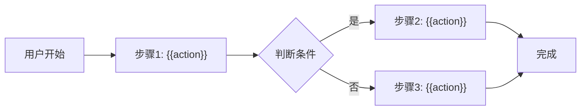

# 业务需求文档模板

> **版本**: v1.0
> **日期**: {{date}}
> **作者**: {{author}}
> **状态**: DRAFT / IN_PROGRESS / DONE

---

## 元数据

```yaml
---
产品域: {{PD-ID}} - {{product_domain_name}}
Epic: {{Epic-ID}} - {{epic_name}}
Epic URI: Epic:{{EPIC-ID}}
需求版本: x.x.x
创建日期: YYYYMMDD
审核人: {{reviewer}}
---
```

---

## 1. 业务背景

### 1.1 业务现状

{{current_situation_description}}

### 1.2 业务痛点

| 痛点 | 描述 | 影响 |
|:---|:---|:---|
| 痛点1 | {{description}} | {{impact}} |
| 痛点2 | {{description}} | {{impact}} |

### 1.3 目标用户

| 用户群体 | 角色 | 描述 |
|:---|:---|:---|
| 用户群体1 | {{role}} | {{description}} |
| 用户群体2 | {{role}} | {{description}} |

---

## 2. 需求概述

### 2.1 需求目标

{{goal_description}}

### 2.2 核心价值

| 价值维度 | 说明 |
|:---|:---|
| 用户价值 | {{user_value}} |
| 业务价值 | {{business_value}} |
| 技术价值 | {{technical_value}} |

### 2.3 成功标准

| 指标 | 目标值 | 衡量方式 |
|:---|:---:|:---|
| {{metric}} | {{target}} | {{measurement}} |

---

## 3. 功能范围

### 3.1 包含的功能

本次需求聚焦 {{feature_name}}，核心覆盖：

{{scope_description}}

### 3.2 不在本次范围内

- {{excluded_1}}
- {{excluded_2}}

---

## 4. 功能详情

### 4.1 功能清单

| 功能点 | 类型 | 描述 |
|:---|:---|:---|
| FP-001 | 页面/接口/数据 | {{description}} |
| FP-002 | 页面/接口/数据 | {{description}} |

### 4.2 用户流程



### 4.3 用户场景

| 场景 | 用户 | 描述 |
|:---|:---|:---|
| 场景1 | {{user}} | {{description}} |
| 场景2 | {{user}} | {{description}} |

---

## 5. 验收标准

| 验收项 | 标准 |
|:---|:---|
| 功能验收 | {{criteria}} |
| 操作验收 | {{criteria}} |
| 数据验收 | {{criteria}} |
| 交互验收 | {{criteria}} |

---

## 6. 依赖关系

### 6.1 依赖的其他 Epic

| Epic ID | 依赖类型 | 说明 |
|:---|:---|:---|
| EPIC-XXX | 数据/功能依赖 | {{description}} |

### 6.2 依赖的外部系统

| 系统 | 依赖类型 | 接口地址 | 说明 |
|:---|:---|:---|:---|
| 系统名 | 接口依赖 | {{api_url}} | {{description}} |

---

## 7. 关联文档

| 文档类型 | 文档名称 | 说明 |
|:---|:---|:---|
| Epic README | 参见：03-EPIC说明文档模板.md | Epic 层级说明 |
| Feature 说明 | 参见：04-Feature说明文档模板.md | Feature 层级说明 |
| PRD | 参见：06-PRD模板.md | 需求详情 |

---

## 8. 变更记录

| 日期 | 版本 | 变更内容 | 作者 |
|:---|:---:|:---|:---|
| {{date}} | v1.0 | 初始版本 | {{author}} |

---

🦾 *业务需求文档模板 v1.0*
