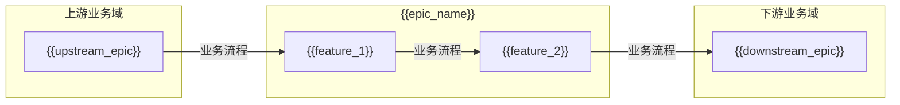
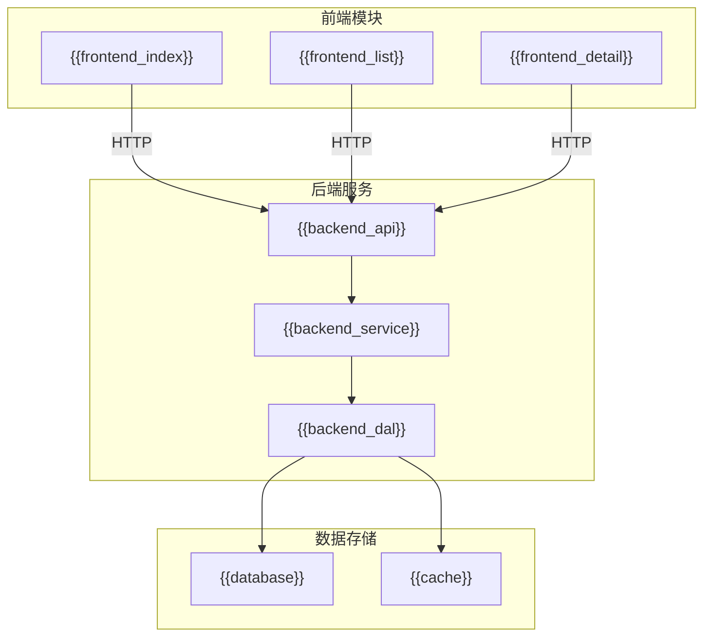

# EPIC 说明文档模板

> **版本**: v1.1
> **日期**: {{date}}
> **作者**: {{author}}

---

## 1. EPIC 基本信息

| 字段 | 内容 |
|:---|:---|
| EPIC ID | {{EPIC-ID}} |
| EPIC 名称 | {{epic_name}} |
| 所属产品域 | {{product_domain}} |
| 负责人 | {{owner}} |
| Feature数 | {{feature_count}} |

---

## 2. 逻辑架构图（业务流程）

> **用途**：描述本 Epic 在业务流程中的位置，与其他业务域的流转关系
> **关注点**：业务流程、活动流转、数据流向
> **特点**：无系统边界概念，关注"做什么"

### 2.1 逻辑流程说明

| 阶段 | 功能 | 业务流程 | 说明 |
|:---|:---|:---|:---|
| 入口 | {{feature_1}} | {{flow_description}} | {{description}} |
| 处理 | {{feature_2}} | {{flow_description}} | {{description}} |
| 出口 | {{feature_out}} | {{flow_description}} | {{description}} |

---

## 3. 物理架构图（系统模块）

> **用途**：描述本 Epic 的前端/后端模块划分和调用关系
> **关注点**：系统边界、模块间调用、数据流
> **特点**：有明确的技术实现和系统边界

### 3.1 系统模块说明

| 模块 | 类型 | 说明 |
|:---|:---|:---|
| {{module_name}} | 前端/后端/数据 | {{description}} |

---

## 4. 功能范围

### 4.1 Feature 清单

| # | Feature ID | Feature 名称 | 优先级 | 状态 |
|:---:|:---|:---|:---:|:---:|
| 1 | FEAT-001 | {{feature_name}} | P0 | {{status}} |
| 2 | FEAT-002 | {{feature_name}} | P1 | {{status}} |

### 4.2 包含的功能

| 功能模块 | 功能描述 |
|:---|:---|
| {{module_1}} | {{description}} |
| {{module_2}} | {{description}} |

### 4.3 不包含的功能

- {{excluded_1}}
- {{excluded_2}}

---

## 5. 菜单结构与功能映射

> **用途**：供技术团队绑定路由和组件

### 5.1 顶部导航栏（全角色可见）

**入口**：{{top_nav}} → {{epic_name}}

| 序号 | 菜单名称 | 功能说明 | 权限说明 |
|:---:|:---|:---|:---|
| 1 | {{menu_name}} | {{function_description}} | {{permission}} |

### 5.2 左侧菜单栏

#### （一）{{module_name}}

| 一级菜单 | 二级菜单 | 功能说明 | 权限说明 |
|:---|:---|:---|:---|
| {{menu_1}} | - | {{description}} | {{permission}} |
| | {{sub_menu}} | {{description}} | {{permission}} |

**适用场景**：{{scenario_description}}

### 5.3 路由与组件映射

| 菜单路径 | 路由 | 组件 | 说明 |
|:---|:---|:---|:---|
| {{menu_path}} | {{route}} | {{component}} | {{description}} |

### 5.4 权限说明

| 角色 | 可访问菜单 |
|:---|:---|
| 管理员 | 全部 |
| 普通用户 | {{visible_menus}} |

---

## 6. 与其他 EPIC 的关系

### 6.1 依赖的 EPIC

| EPIC ID | 依赖类型 | 说明 |
|:---|:---|:---|
| EPIC-XXX | 数据/功能依赖 | {{description}} |

### 6.2 被依赖的 EPIC

| EPIC ID | 说明 |
|:---|:---|
| EPIC-YYY | {{description}} |

---

## 7. 技术说明

### 7.1 技术选型

| 层级 | 技术选型 | 说明 |
|:---|:---|:---|
| 前端 | {{tech}} | {{description}} |
| 后端 | {{tech}} | {{description}} |
| 数据库 | {{tech}} | {{description}} |

### 7.2 关键接口

| 接口 | 说明 |
|:---|:---|
| API-001 | {{description}} |

---

## 8. 变更记录

| 日期 | 版本 | 变更内容 | 作者 |
|:---|:---:|:---|:---|
| {{date}} | v1.0 | 初始版本 | {{author}} |
| {{date}} | v1.1 | 增加逻辑架构图与物理架构图 | {{author}} |

---

🦍 *EPIC 说明文档模板 v1.1*
