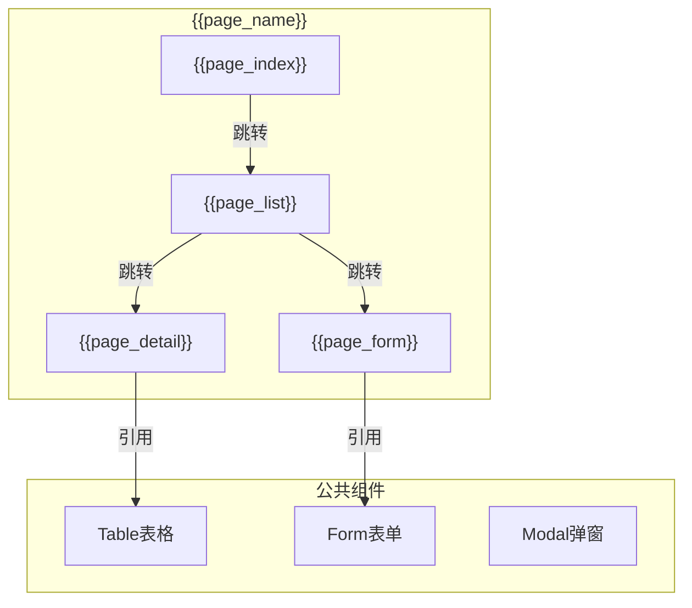
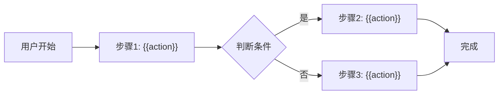
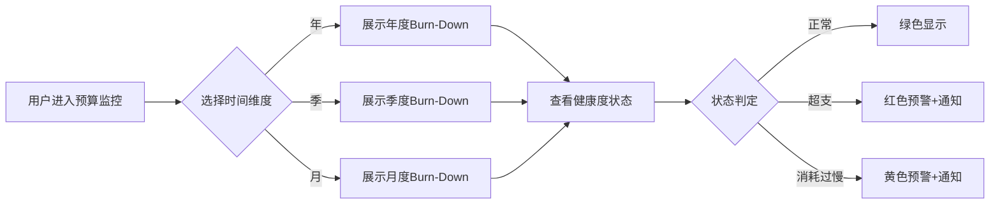
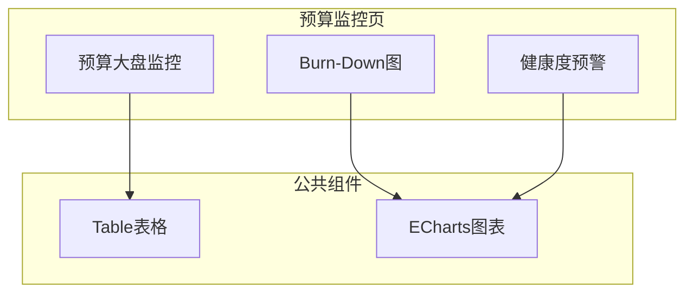
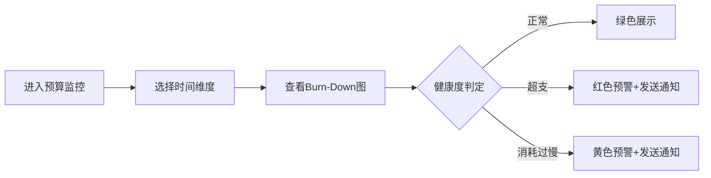

# Feature 说明文档模板

> **版本**: v1.2
> **日期**: 2026-04-28
> **作者**: Tony Stark
> **更新说明**: v1.2 补充各章节内容归属指南，避免冗余章节

---

## 模板使用指南

### 内容归属原则（避免冗余章节）

| 要描述的内容 | 应该写入的章节 | 示例写法 |
|:---|:---|:---|
| 筛选器/控件 | 功能清单(4.1) 的 FP 描述中 | "FP-001: 预算筛选器，支持业务类型多选(默认全选)、平台产品搜索、目标贷余单选" |
| 计算规则/判定逻辑 | 功能清单(4.1) 的 FP 描述中 | "FP-002: 健康度判定，实际剩余/预估剩余>1.1为超支，<0.9为消耗过慢" |
| 预警触发条件 | 验收标准(5) | "预警触发：实际剩余预算低于预估剩余的X%时发送通知" |
| 数据表/数据来源 | 依赖关系(6) | "adm.ads_report_ws_prod_consuption_full: 预算数据" |
| 状态流转规则 | 功能清单(4.1) 或 用户流程(4.2) | "FP-003: 状态流转，引入中→上线中需满足关联合同+借款信息条件" |

**⚠️ 避免创建独立章节**：筛选器说明、计算规则、预警规则、数据来源等内容应归入上述章节，单独建章节会造成结构冗余。

---

## 1. Feature 基本信息

```markdown
| 字段 | 内容 |
|:---|:---|
| Feature ID | {{FEAT-ID}} |
| Feature 名称 | {{feature_name}} |
| 所属 EPIC | {{epic_id}} |
| 所属产品域 | {{product_domain}} |
| 负责人 | {{owner}} |
```

**示例**：
| 字段 | 内容 |
|:---|:---|
| Feature ID | FEAT-RISK-EXT-BUDGET-MONITOR |
| Feature 名称 | 预算监控 |
| 所属 EPIC | EPIC-RISK-EXT |
| 所属产品域 | PD-RISK 数字风险 |
| 负责人 | Tony Stark |

---

## 2. Feature 概述

### 2.1 是什么
一句话描述本 Feature 的核心功能。

### 2.2 解决什么问题
用bullet list描述痛点，每个痛点一句话。

### 2.3 用户场景

| 场景 | 用户 | 描述 |
|:---|:---|:---|
| 场景1 | {{user}} | {{description}} |
| 场景2 | {{user}} | {{description}} |

---

## 3. 系统模块图（页面/组件结构）

> **用途**：描述本 Feature 的前端页面结构和组件关系
> **关注点**：页面层级、组件划分、路由绑定



### 3.1 页面说明

| 页面 | 路由 | 组件 | 说明 |
|:---|:---|:---|:---|
| {{page_name}} | {{route}} | {{component}} | {{description}} |

### 3.2 组件说明

| 组件 | 类型 | 说明 |
|:---|:---|:---|
| {{component_name}} | 业务/公共 | {{description}} |

---

## 4. 功能说明

### 4.1 功能清单

> **⚠️ 重要**：业务规则（筛选器默认值、计算公式、判定逻辑、状态流转）直接写在 FP 描述里，不要单独建章节。

| 功能点 | 类型 | 描述 |
|:---|:---|:---|
| FP-001 | 页面/接口/数据 | **必须包含业务规则描述**，如筛选器默认值、计算逻辑、判定条件等 |
| FP-002 | 页面/接口/数据 | 描述本功能点的具体行为 |

**✅ 正确写法示例**：

| 功能点 | 类型 | 描述 |
|:---|:---|:---|
| FP-001 | 页面 | 预算大盘监控，展示实际使用量/总预算/当前进度。**筛选器**：业务类型多选(默认全选)、平台产品搜索、目标贷余单选、时间维度支持年/季/月切换 |
| FP-002 | 页面 | Burn-Down图，区分预估剩余和实际剩余。**计算规则**：预估剩余=总预算-累计预算(按月)；实际剩余=总预算-累计实际消耗(按月) |
| FP-003 | 页面 | 健康度预警模块。**判定规则**：正常=实际剩余/预估剩余∈[0.9,1.1]；超支>1.1；消耗过慢<0.9 |

**❌ 错误写法示例**（不要这样写）：

```
### 3.3 筛选器说明
| 筛选项 | 控件类型 | 默认值 |
|:---|:---|:---|

### 3.4 计算规则
| 类型 | 计算逻辑 |
|:---|:---|
```

### 4.2 用户流程

> **用途**：描述用户操作步骤和判断逻辑，包含关键分支条件



**✅ 用户流程示例**：



---

## 5. 验收标准

> **⚠️ 重要**：预警触发条件、性能要求等写在验收标准里，不要单独建章节。

| 验收项 | 标准 |
|:---|:---|
| 功能验收 | 具体功能要求，**包含预警触发条件** |
| 性能验收 | 响应时间、并发等要求 |
| 交互验收 | 交互细节要求 |

**✅ 正确写法示例**：

| 验收项 | 标准 |
|:---|:---|
| 功能验收 | 展示实际使用量/总预算/当前进度；Burn-Down图区分预估和实际；健康度预警正确计算和显示 |
| 功能验收 | **预警触发**：实际剩余预算低于预估剩余的X%时，触发预算超支风险预警，发送通知 |
| 性能验收 | 页面加载时间≤2s，数据刷新≤1s |
| 交互验收 | 支持时间维度切换，支持导出数据 |

---

## 6. 依赖关系

> **⚠️ 重要**：数据来源（数据表）写在依赖关系里，不要单独建章节。

| 依赖项 | 类型 | 说明 |
|:---|:---|:---|
| {{dependency}} | 接口/数据 | **数据来源表/接口地址+用途** |

**✅ 正确写法示例**：

| 依赖项 | 类型 | 说明 |
|:---|:---|:---|
| adm.ads_report_ws_prod_consuption_full | 数据 | 预算数据来源，存储各业务类型的预算配置 |
| adm.dws_ws_prod_consuption_full | 数据 | 实际消耗数据来源，存储每日消耗明细 |
| 外部对账系统 | 接口 | 获取供应商对账单数据 |

**❌ 错误写法示例**（不要这样写）：

```
### 第4章 数据来源

| 数据表 | 说明 |
|:---|:---|
```

---

## 7. 变更记录

| 日期 | 版本 | 变更内容 | 作者 |
|:---|:---:|:---|:---|
| {{date}} | v1.0 | 初始版本 | {{author}} |
| {{date}} | v1.1 | 增加系统模块图（页面/组件结构） | {{author}} |
| {{date}} | v1.2 | 补充内容归属指南，避免冗余章节 | {{author}} |

---

## 📝 完整示例：预算监控 Feature

```markdown
# Feature说明文档 - 预算监控

> **版本**: v1.0
> **日期**: 2026-04-28
> **作者**: Tony Stark

---

## 1. Feature 基本信息

| 字段 | 内容 |
|:---|:---|
| Feature ID | FEAT-RISK-EXT-BUDGET-MONITOR |
| Feature 名称 | 预算监控 |
| 所属 EPIC | EPIC-RISK-EXT |
| 所属产品域 | PD-RISK 数字风险 |
| 负责人 | Tony Stark |

---

## 2. Feature 概述

### 2.1 是什么
预算监控模块用于监控和分析整体预算消耗情况，支持按业务类型、平台产品、目标贷余筛选，展示Burn-Down图和预警信息。

### 2.2 解决什么问题
- 预算超支、消耗过慢等异常情况无法及时预警
- 没有打通预警通知的信息闭环
- 缺乏可视化的预算执行分析工具

### 2.3 用户场景

| 场景 | 用户 | 描述 |
|:---|:---|:---|
| 预算执行监控 | 采购管理 | 实时查看预算消耗进度 |
| 异常预警 | 系统 | 低于阈值时触发告警 |
| 归因分析 | 采购管理 | 分析预算差异原因 |

---

## 3. 系统模块图



### 3.1 页面说明

| 页面 | 路由 | 组件 | 说明 |
|:---|:---|:---|:---|
| 预算监控 | /risk/budget/monitor | BudgetMonitorPage | 默认首页 |
| Burn-Down详情 | /risk/budget/burndown | BurnDownChart | 可从大盘跳转 |

### 3.2 组件说明

| 组件 | 类型 | 说明 |
|:---|:---|:---|
| BudgetFilter | 业务 | 预算筛选器组件 |
| BurnDownChart | 公共 | Burn-Down图组件(ECharts) |
| AlertBadge | 公共 | 健康度状态徽章 |

---

## 4. 功能说明

### 4.1 功能清单

| 功能点 | 类型 | 描述 |
|:---|:---|:---|
| FP-001 | 页面 | 预算大盘监控，展示实际使用量/总预算/当前进度。**筛选器**：业务类型多选(默认全选)、平台产品搜索(支持搜索)、目标贷余单选、时间维度支持年/季/月切换 |
| FP-002 | 页面 | Burn-Down图，区分预估剩余和实际剩余。**计算规则**：预估剩余=总预算-累计预算(按月)；实际剩余=总预算-累计实际消耗(按月) |
| FP-003 | 页面 | 健康度预警模块。**判定规则**：正常=实际剩余/预估剩余∈[0.9,1.1]；超支>1.1；消耗过慢<0.9 |
| FP-004 | 页面 | 详情分析，支持下钻实际消耗明细 |
| FP-005 | 页面 | 业务过程比对，展示预估vs实际对比曲线 |

### 4.2 用户流程



---

## 5. 验收标准

| 验收项 | 标准 |
|:---|:---|
| 功能验收 | 展示实际使用量/总预算/当前进度 |
| 功能验收 | Burn-Down图区分预估和实际两条曲线 |
| 功能验收 | 健康度预警正确计算和显示（正常/超支/消耗过慢） |
| 功能验收 | **预警触发**：实际剩余预算低于预估剩余的X%时，触发预算超支风险预警，发送通知到责任人 |
| 交互验收 | 支持时间维度切换（年/季/月） |
| 交互验收 | 支持导出数据（Excel/CSV） |
| 性能验收 | 页面加载≤2s，数据刷新≤1s |

---

## 6. 依赖关系

| 依赖项 | 类型 | 说明 |
|:---|:---|:---|
| adm.ads_report_ws_prod_consuption_full | 数据 | 预算数据表，存储各业务类型/平台产品的预算配置 |
| adm.dws_ws_prod_consuption_full | 数据 | 实际消耗数据表，存储每日消耗明细 |
| 消息通知服务 | 接口 | 发送预警通知 |

---

## 7. 变更记录

| 日期 | 版本 | 变更内容 | 作者 |
|:---|:---:|:---|:---|
| 2026-04-28 | v1.0 | 初始版本 | Tony Stark |

---

🦍 *Feature 说明文档模板 v1.2*
```

---

## 核心原则总结

1. **业务规则写入 FP 描述**：筛选器默认值、计算公式、判定逻辑都在 FP 描述里一句话说清楚
2. **预警条件写入验收标准**：触发条件写在验收标准的功能验收或性能验收里
3. **数据来源写入依赖关系**：数据表、接口都写在第6章依赖关系
4. **避免冗余章节**：不要创建"计算规则章""筛选器说明章""数据来源章"，这些内容都有归属章节

---

🦾 *"模板 v1.2 已更新，给出了完整示例和内容归属指南。"*
