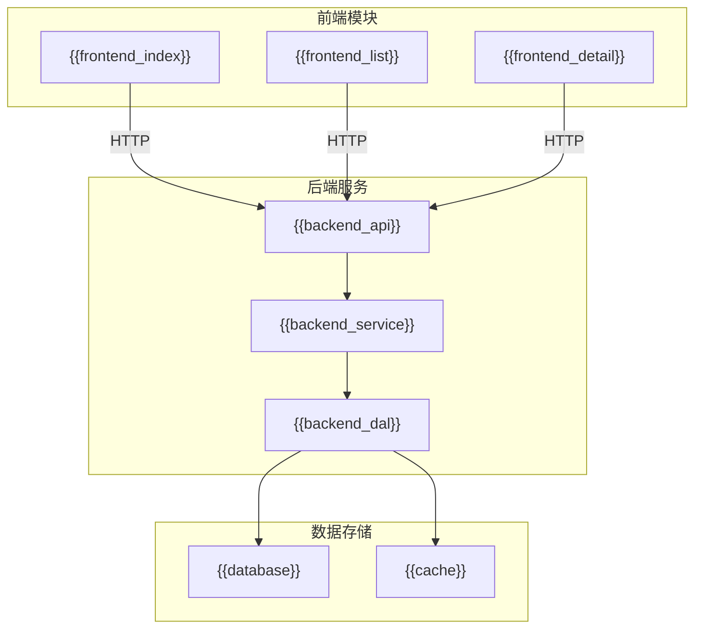
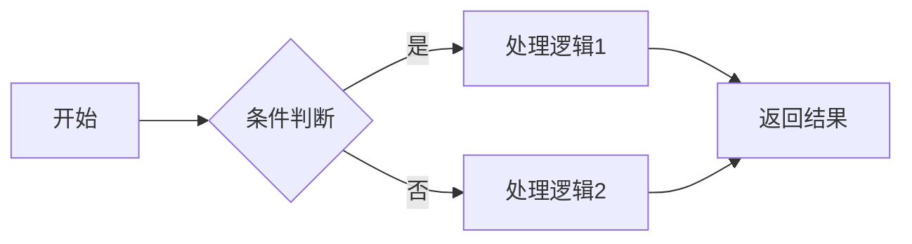

# 技术方案模板

> **版本**: v1.0
> **日期**: {{date}}
> **作者**: {{author}}
> **状态**: DRAFT / IN_PROGRESS / DONE

---

## 元数据

```yaml
---
产品域: {{PD-ID}} - {{product_domain_name}}
Epic: {{Epic-ID}} - {{epic_name}}
Epic URI: Epic:{{EPIC-ID}}
Feature: {{FEAT-ID}} - {{feature_name}}
Feature URI: Feature:{{FEAT-ID}}
技术方案版本: x.x.x
创建日期: YYYYMMDD
审核人: {{reviewer}}
---
```

---

## 1. 技术方案概述

### 1.1 功能描述

{{feature_description}}

### 1.2 技术目标

| 目标 | 说明 |
|:---|:---|
| 性能目标 | {{performance_target}} |
| 可用性目标 | {{availability_target}} |
| 安全目标 | {{security_target}} |

---

## 2. 技术架构

### 2.1 系统架构图



### 2.2 模块说明

| 模块 | 类型 | 说明 |
|:---|:---|:---|
| {{module_name}} | 前端/后端/数据 | {{description}} |

---

## 3. 详细设计

### 3.1 数据库设计

#### 3.1.1 表结构

| 表名 | 说明 |
|:---|:---|
| {{table_name}} | {{description}} |

**字段设计**：

| 字段名 | 类型 | 说明 |
|:---|:---|:---|
| {{field}} | {{type}} | {{description}} |

#### 3.1.2 索引设计

| 索引名 | 字段 | 类型 | 说明 |
|:---|:---|:---|:---|
| {{index}} | {{fields}} | {{type}} | {{description}} |

### 3.2 接口设计

#### 3.2.1 接口列表

| 接口路径 | 方法 | 说明 |
|:---|:---|:---|
| /api/xxx | GET/POST/PUT/DELETE | {{description}} |

#### 3.2.2 接口详情

**GET /api/xxx**

请求参数：

| 参数名 | 类型 | 必填 | 说明 |
|:---|:---|:---:|:---|
| {{param}} | {{type}} | 是/否 | {{description}} |

响应示例：

```json
{
  "code": 200,
  "data": {}
}
```

### 3.3 核心逻辑



---

## 4. 技术选型

| 层级 | 技术选型 | 说明 |
|:---|:---|:---|
| 前端 | {{tech}} | {{description}} |
| 后端 | {{tech}} | {{description}} |
| 数据库 | {{tech}} | {{description}} |
| 缓存 | {{tech}} | {{description}} |
| 消息队列 | {{tech}} | {{description}} |

---

## 5. 依赖与风险

### 5.1 技术依赖

| 依赖项 | 类型 | 说明 |
|:---|:---|:---|
| {{dependency}} | 接口/服务/数据 | {{description}} |

### 5.2 技术风险

| 风险 | 影响 | 应对措施 |
|:---|:---|:---|
| {{risk}} | {{impact}} | {{mitigation}} |

---

## 6. 测试要点

| 测试类型 | 测试要点 |
|:---|:---|
| 单元测试 | {{points}} |
| 集成测试 | {{points}} |
| 性能测试 | {{points}} |

---

## 7. 部署说明

| 环境 | 部署方式 | 说明 |
|:---|:---|:---|
| 测试环境 | {{method}} | {{description}} |
| 生产环境 | {{method}} | {{description}} |

---

## 8. 关联文档

| 文档类型 | 文档名称 | 说明 |
|:---|:---|:---|
| Feature 说明 | 参见：04-Feature说明文档模板.md | Feature 层级说明 |
| FP 清单 | 参见：05-FeaturePoint清单模板.md | FP 清单 |
| PRD | 参见：06-PRD模板.md | 需求详情 |

---

## 9. 变更记录

| 日期 | 版本 | 变更内容 | 作者 |
|:---|:---:|:---|:---|
| {{date}} | v1.0 | 初始版本 | {{author}} |

---

🦾 *技术方案模板 v1.0*
