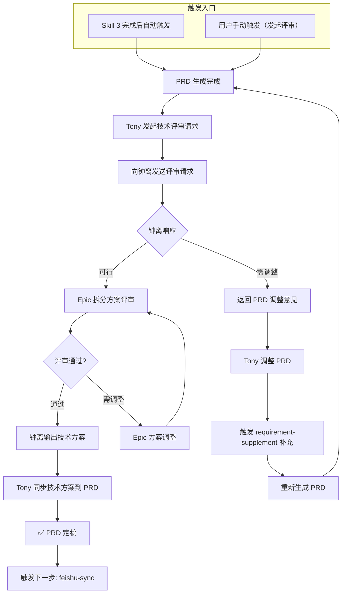

# Tony-Zhongli Collaboration Skill

## 能做什么

Tony（产品）和钟离（技术专家）之间的协作接口，负责 PRD 技术可行性确认、Epic 拆分方案确认、技术方案评审。

## 核心能力

1. **技术评审请求**：PRD 生成后，Tony 向钟离发起技术可行性确认
2. **Epic 拆分评审**：钟离对 Epic 拆分方案进行技术评审
3. **技术方案输出**：钟离输出技术方案，Tony 同步到 PRD
4. **评审结果记录**：记录评审意见和决策

## 激活条件

- **Skill 3 自动触发**：prd-generation 完成后自动进入（无需用户再次触发）
- 用户明确要求发起技术评审（"发起评审"、"技术评审"、"让钟离看看"）

---

## 协作场景

| 场景 | 说明 | 触发条件 |
| 技术可行性确认 | PRD 生成后，请钟离确认技术可行性 | "确认技术可行性"、"技术评审" |
| Epic 拆分评审 | 请钟离评审 Epic 拆分方案 | "评审 Epic"、"拆分方案" |
| 技术方案输出 | 钟离输出技术方案，Tony 同步到 PRD | "输出技术方案"、"同步技术方案" |
| 评审结果确认 | Tony 确认评审结果，决定是否继续 | "确认评审"、"评审通过" |

---

## 协作流程图（Mermaid）



---

## 评审请求格式

### Tony → 钟离

```markdown
## 技术评审请求

**PRD 编号**: PRD-{YYYYMMDD}-{序号}
**产品域**: {PD-XX}
**Epic**: {Epic 名称}
**评审类型**: [技术可行性 / Epic 拆分 / 技术方案]

### 评审要点
1. {评审要点1}
2. {评审要点2}
3. {评审要点3}

### 需要确认的问题
- {问题1}
- {问题2}

### 截止时间
{YYYY-MM-DD}
```

### 钟离 → Tony

```markdown
## 技术评审回复

**评审类型**: {评审类型}
**评审结论**: [可行 / 需调整 / 不可行]

### 评审意见
{详细评审意见}

### 调整建议
{如有调整建议，列出具体调整项}

### 技术方案
{如评审通过，输出技术方案}
```

---

## 中间文档留存

| 文档 | 路径 | 说明 |
|评审请求 | /tmp/collab/request_{prd_id}.md | Tony 发起的评审请求 |
| 评审回复 | /tmp/collab/reply_{prd_id}.md | 钟离的评审回复 |
| 技术方案 | /tmp/collab/tech_{prd_id}.md | 最终技术方案 |
| 评审记录 | /tmp/collab/record_{prd_id}.json | 评审决策记录 |

---

## 错误处理原则

1. 钟离无响应 → 等待 1 天后提醒，最多提醒 3 次
2. 评审不通过 → 返回 PRD 调整，循环直到通过
3. 技术方案无法输出 → 标注"待钟离输出"，不影响流程
4. 协作中断 → 保存当前状态，等待人工介入

---

## 依赖 Skill

| Skill | 关系 | 说明 |
| prd-generation | 前置 | PRD 生成完成后，进入 Tony-钟离协作 |
| requirement-supplement | 调整时触发 | PRD 需调整时，补充需求内容 |
| feishu-sync | 后续 | PRD 定稿后，同步到飞书 |

---

*Version: 1.0 | For: Tony Stark*
