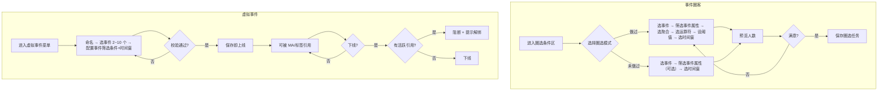

# 事件圈客与虚拟事件组合

> 来源: Get 笔记
> 知识库: digital-community (数字社区)
> KB 等级: ⭐self
> KB ID: EJlOEG10
> 原始 ID: 1917497643325755592
> 创建时间: 2026-08-04 10:00:42
> 同步时间: 2026-08-05T06:00:41.883690

> **30秒速览**：运营在客群中心通过「事件圈客」直接基于事件明细和事件属性圈选人群；通过「虚拟事件」把多个事件按合并规则+筛选条件+时间窗封装成可复用对象，供 MA/标签引用，一次配置多次复用，不再依赖研发写 SQL。

---

## 一、背景与目标

### 为什么做

客群中心现有圈选仅支持**标签圈选**和**行为序列圈选**，运营无法直接基于"事件明细 + 跨事件组合"做精准圈选。跨源、跨实体的复杂行为必须依赖研发写 SQL，出活慢、不可复用。

### 核心场景

运营在日常活动/营销节点下，通过「事件圈客 + 虚拟事件组合」配置条件，实现一次配置多次复用、跨域圈选自助完成。

### 目标用户


| 角色     | 核心诉求                   | 频率  |
| ------ | ---------------------- | --- |
| 运营人员   | 快速圈出"做过/未做过"的目标人群      | 每天  |
| 数据分析师  | 用虚拟事件组合封装复杂 SQL，降低自助门槛 | 每周  |
| 审核员    | 审查圈选逻辑合规性              | 每周  |
| 研发（支撑） | 仅在自助失败时兜底              | 偶尔  |


---

## 二、功能模块

### 交互流程总览



### 模块 A：事件圈客

运营在圈选条件区选择「事件类型」，配置条件后预览人数。支持两种圈选模式：

#### A1. 做过（P0）

**交互流程**：选事件 → 筛选事件属性 → 选聚合方式 → 选运算符 → 设阈值 → 选时间窗 → 预览

**事件属性筛选**：选中事件后，从事件注册列表拉取该事件的属性元数据，展示可筛选属性。用户可对事件属性设条件（如：支付方式=微信、金额>100），属性筛选项随事件动态变化。

**默认值**：做过 + 总次数 + ≥ 1 + 近 7 天

**业务规则**：圈出时间窗内事件属性满足筛选条件、且总次数/属性值满足阈值的用户集合 A。阈值范围 [1, 9999]。时间窗上限 30 天（等效 720 小时 / 43200 分钟）。

**异常处理**：

- 事件无数据 → 提示「近 90 天无该事件」
- 事件未注册属性 → 属性筛选区显示「该事件无可用属性」
- 接口超时/5xx → 顶部红条「圈选失败，请重试」+ 错误码

**验收**：

> Given 数据源已选  
> When 选择「做过」+「立即支付」+「总次数」+「≥ 3」+「近 7 天」  
> Then 预览显示 3 天内立即支付 ≥ 3 次的用户人数  
> And 30 秒内返回，误差 < 1%

#### A2. 未做过（P0）

**交互流程**：选事件 → 筛选事件属性（可选）→ 选时间窗 → 预览（自动排除）

**事件属性筛选**：同 A1，从事件注册列表拉取属性元数据，可对事件属性设条件进一步限定"做过"的范围，排除逻辑基于筛选后的结果集。

**业务规则**：结果 = 数据源用户 - 时间窗内满足属性筛选条件且做过该事件的用户。需先选数据源。时间窗上限 30 天（等效 720 小时 / 43200 分钟）。

**异常处理**：数据源为空 → 提示「请先选择数据来源」

#### 圈选条件组合规则

多条件支持「且/或/交/并/差」集合运算，最多 2 层嵌套。

---

### 模块 B：虚拟事件

把多个事件按合并规则组合，对每个事件可配置筛选条件和时间窗限制，封装成一个可复用的"虚拟事件"对象，供 MA/标签等业务引用。

#### B1. 新建（P0）

**交互流程**：命名 → 选事件 2~10 个 → 对每个事件配置筛选条件和时间窗 → 校验 → 保存即上线

**组合方式**：合并（OR）——2~10 个事件取并集，满足任一即命中。每个事件可独立配置属性筛选条件（如：支付方式=微信）和时间窗限制。实时规则，无需跑批，保存后即时生效。

**校验规则**：未选事件或事件数 < 2 或 > 10 → 阻止保存

**验收**：

> Given 在虚拟事件新建页  
> When 选择「合并」+ 事件[收藏, 加购]，配置筛选条件，保存  
> Then 保存校验通过后即时上线  
> And 可被 MA/标签引用

#### B2. 编辑（P0）

**交互流程**：校验引用 → 修改内容 → 保存

**版本控制**：被引用次数 > 10 → 强制新建版本，不可直接覆盖。

#### B3. 引用（P0）

**交互流程**：在 MA/标签配置中选「虚拟事件」作为数据来源 → 预览

**展示**：引用次数 > 0 时显示「被 X 个 MA/标签引用」

**异常处理**：虚拟事件已下线 → 红字提示 + 禁用

#### B4. 下线（P1）

**交互流程**：校验关联 → 弹窗显示引用数 → 二次确认 → 下线

**阻断规则**：有活跃引用（MA/标签/圈选条件）→ 阻断 + 提示「请先解绑」

**验收**：

> Given 虚拟事件被 3 个 MA 任务 + 2 个圈选条件引用  
> When 用户点「下线」  
> Then 弹窗显示引用详情，下线按钮禁用，需跳转解绑

---

## 三、虚拟事件生命周期

### 状态流转

```
新建 →（保存）→ 上线 →（用户下线）→ 下线
                  ↑                       │
                  └──（重新启用）←─────────┘
```

虚拟事件无草稿态，保存即上线，即时加入圈选可选项。

**异常分支**：

- 保存校验失败 → 停留在新建页，标红提示
- 关联源事件被归档 → 自动下线（不可逆，需重建）


| 当前状态 | 触发条件      | 目标状态 | 执行动作                  | 异常              |
| ---- | --------- | ---- | --------------------- | --------------- |
| 新建   | 保存校验通过    | 上线   | 写入 DB，生成 ID，即时加入圈选可选项 | 校验失败 → 停留新建页    |
| 上线   | 用户点「下线」   | 下线   | 校验无活跃引用后标记 archived   | 有引用 → 阻止 + 提示解绑 |
| 下线   | 用户点「重新启用」 | 上线   | 恢复可选项                 | 引用源已删除 → 失败     |
| 下线   | 用户点「删除」   | （软删） | archived_at 写入        | —               |
| 任一   | 关联事件被归档   | 自动下线 | 标记 + 通知创建人            | 不可逆             |


### 并发编辑处理

> Given 用户 A 和 B 同时编辑同一虚拟事件  
> When B 先保存成功，A 后保存  
> Then A 收到提示「该事件已被 B 于 X 时间修改，请刷新」，A 的修改不写入

---

## 四、接口契约

### 接口清单


| 接口        | 方向  | 触发时机       | 调用方 → 提供方   | 优先级 |
| --------- | --- | ---------- | ----------- | --- |
| 事件列表查询    | 拉取  | 进入圈选条件配置   | 前端 → 事件中心   | P0  |
| 圈选预览/计算   | 拉取  | 用户点「预览人数」  | 前端 → 圈选引擎   | P0  |
| 圈选任务保存    | 推送  | 用户点「保存」    | 前端 → 圈选引擎   | P0  |
| 虚拟事件 CRUD | 推+拉 | 列表/编辑页     | 前端 → 虚拟事件服务 | P0  |
| 虚拟事件版本校验  | 拉取  | 用户点「编辑」    | 前端 → 虚拟事件服务 | P0  |
| 虚拟事件引用检查  | 拉取  | 用户点「下线」    | 前端 → 虚拟事件服务 | P1  |
| 虚拟事件上下线   | 推送  | 用户点「上线/下线」 | 前端 → 虚拟事件服务 | P0  |
| 圈选结果回写画像  | 推送  | 计算成功后      | 圈选引擎 → 用户画像 | P1  |


> 字段定义走标准 Swagger/OpenAPI 文档，本简化版不重复展开。

### 关键约束


| 维度   | 约束                                         |
| ---- | ------------------------------------------ |
| 一致性  | 圈选计算与画像回写走同一事务，失败回滚                        |
| 时效性  | 预览 ≤ 30s / 完整保存 ≤ 30min；虚拟事件合并为实时规则，保存即生效  |
| 量级   | 单虚拟事件覆盖 ≤ 1000w 用户；单圈选任务 ≤ 5000w           |
| 排序   | 事件列表按「近 90 天触发量」降序                         |
| 变更通知 | 虚拟事件上下线通过事件总线广播至 MA/标签/圈选，任一失败进重试队列，不可静默丢失 |


---

## 五、页面状态速查


| 页面     | 状态   | 触发条件       | 表现                     |
| ------ | ---- | ---------- | ---------------------- |
| 事件圈选配置 | 初始态  | 进入条件区      | 默认选中「做过+总次数+≥1+近7天」    |
| 事件圈选配置 | 加载态  | 拉取事件列表     | 骨架屏，按钮禁用               |
| 事件圈选配置 | 空态   | 数据源无事件     | 提示「该数据源暂无事件，请联系数据团队接入」 |
| 事件圈选配置 | 错误态  | 接口 5xx/超时  | 顶部红条 + 错误码             |
| 虚拟事件列表 | 加载态  | 首屏         | 表格骨架                   |
| 虚拟事件列表 | 空态   | 列表为空       | 插画 + 「新建第一个虚拟事件」按钮     |
| 虚拟事件编辑 | 校验失败 | 必填缺失/事件无数据 | 错误项标红 + 保存禁用           |
| 虚拟事件预览 | 计算中  | 人数 > 100w  | 转圈 + 预估剩余时间            |


> **体验重点**：8 类页面状态中，「加载态 + 错误态 + 校验失败态」是体验分水岭，需重点打磨。

