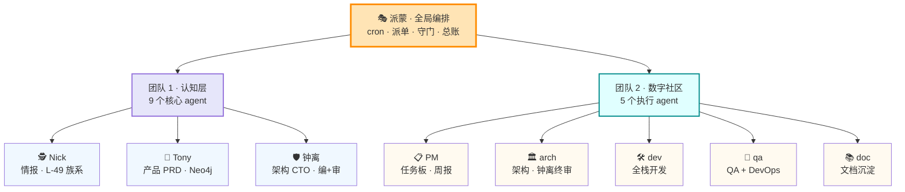
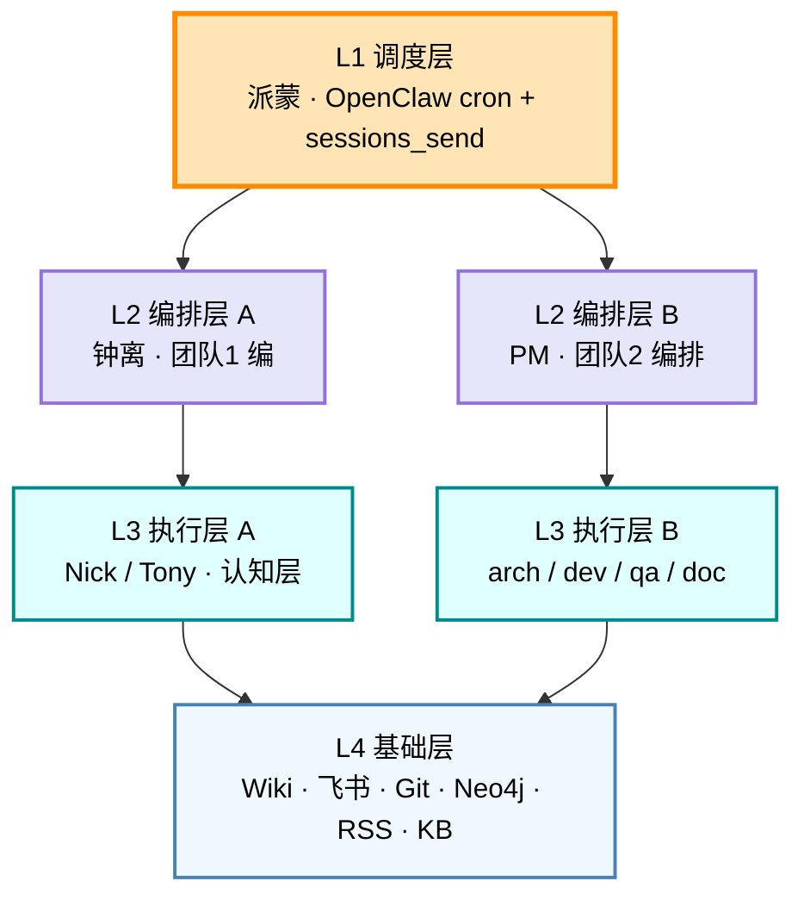

# 🤖 Agent 团队工程化概述 · 2026 H2 实测快照

> **数据截止**：2026-07-24 15:40 CST（实测 · 数据源见 §7.3）
> **作者**：尼克·弗瑞 🕵️ · 教练式研究分析师
> **适用场景**：30 分钟分享 / 内部培训 / Wiki 永久素材
> **审计依据**：L-37 / L-38（报告必调实时 API + 完整分类）
> **一句话**：把"一个人 + Mac mini"升级为"一个人 + 一支 AI 数字研发组织"

---

## 目录

1. [产品定位 · 我们在做什么](#一产品定位--我们在做什么产品视角)
2. [业务架构 · 服务谁 · 怎么做事](#二业务架构--服务谁--怎么做事业务视角)
3. [技术实现 · 17 Agent 如何分工](#三技术实现--17-agent-如何分工技术视角)
4. [工程化要素 · 6 维实证](#四工程化要素--6-维实证)
5. [演进路径 · V1 → V5](#五演进路径--v1--v5)
6. [一句话总结](#六一句话总结适合-notion--团队主页)
7. [附录 · 引用与索引](#七附录--引用与索引)
8. [版本与维护](#八版本与维护)

---

## 一、产品定位 · 我们在做什么（产品视角）

**一句话**：**为文博个人 + Mac mini 搭建一套"AI Agent 团队操作系统"，把"一个人 + 多设备"升级为"一个人 + 一个数字研发组织"。**

### 1.1 三个核心交付

| 交付 | 含义 | 频率 |
|:---|:---|:---|
| **认知支持** | 投资决策 / 技术雷达 / 行业研究 | 每日 5-10 篇 |
| **产品/架构辅助** | PRD 拆解 / Neo4j 知识图 / 架构评审 | 按需 |
| **数字社区执行** | PM → arch → dev → qa → doc 全链路 | 周维度 |

### 1.2 三层价值

- **效率价值**：把文博 1 人变成 1 + N 的团队协同
- **方法论价值**：沉淀 Wiki + L-49 族系 + INC 闭环（可审计 / 可演进）
- **自治价值**：cron 自动化 + V5 看门狗自治（7-24 起闭环）

---

## 二、业务架构 · 服务谁 · 怎么做事（业务视角）

### 2.1 双团队 · 10 核心 + 7 工具 Agent（实证 17 个）

**实证来源**：`openclaw agents list` 实测 **17 个** agent（不是 15 也不是 30，L-38 治本）。



### 2.2 角色矩阵（10 核心）

| 团队 | Agent | 业务职责 | Emoji | agent ID |
|:---|:---|:---|:---:|:---|
| **总协调** | 派蒙 | 派单 · cron 守门 · 飞书总账 · 任务板 | 🎭 | main |
| **团队1** | 尼克·弗瑞 | 情报 · L-49 族系方法论 · Wiki 沉淀 · INC 闭环 | 🕵️ | nick_fury |
| **团队1** | 托尼·斯塔克 | 产品 PRD · Neo4j 知识图 · Epic/Feature/Story 拆解 | 🦾 | tony_stark |
| **团队1** | 钟离 | 架构 CTO · 团队1 编排 · 团队2 每周 ≤1h 终审 | 🛡️ | zhongli |
| **团队2** | PM | 任务板派单 · 周报 · 跨 Agent 协调 | 📋 | data_community_pm |
| **团队2** | arch | 数字社区架构（钟离终审） | 🏛️ | data_community_arch |
| **团队2** | dev | 全栈开发 · 测试集成 | 🛠️ | data_community_dev |
| **团队2** | qa | QA + DevOps | 🧪 | data_community_qa |
| **团队2** | doc | 文档沉淀 · Wiki | 📚 | data_community_doc |

**7 边缘 Agent**（不入核心介绍）：内容专家 / 交互测试 / 问小数 / 阿加莘 / 小二子 / 麦麦 / 老六 / smith。

### 2.3 协作约定

- **派单渠道**：`sessions_send agentId` + task_tool 任务板实证（L-49.8 治本）
- **交付渠道**：cron 化飞书推送（lark-cli 主通道 · L-35 治本 · L-36 退出码）
- **闭环机制**：INC（事故）+ Lesson（教训）+ Registry（增量区 · L-31）
- **守门机制**：C-3 每日 21:00 自检 + cron.argv.watchdog 每周日 21:00（7-24 V5 拐点）

---

## 三、技术实现 · 17 Agent 如何分工（技术视角）

### 3.1 四层架构



### 3.2 关键技术栈（实证）

| 层 | 组件 | 用途 |
|:---|:---|:---|
| **运行环境** | OpenClaw 2026.6.6 | Agent 调度 · cron · 会话路由 · 飞书投递 |
| **消息** | 飞书 (lark-cli + send_as_user) | IM 推送 · 知识库 · 多维表格 |
| **LLM** | minimax/MiniMax-M3 | 默认模型（团队共享） |
| **知识库** | Wiki 1783 文档 · RAG + Obsidian | 团队知识沉淀 |
| **数据流** | 272 RSS 源 · Get 笔记 8 KB · 飞书群 | 情报 · 个人知识 · 协作 |
| **图谱** | Neo4j `7687` (Tony 侧) | 产品需求图 |
| **协作工具** | 飞书多维表格 · Git · Codemm | 任务板 · 文档协作 |
| **自动化** | 48 OpenClaw cron + 4 launchd plist | 定时任务 |

### 3.3 关键架构 insight（来自 Wiki insight 库）

> 来源：`insights/ai-pm/insight-20260715-Agent架构选型2026：从确定性到概率性的光谱.md`
>
> **17 个 Agent 不是扁平的"16 Worker + 1 编排"，而是两层编排 + 1 共享层**。
>
> - 派蒙（大总管，跨团队协调）是全局编排者
> - 钟离（研发 CTO，团队1全程设计）是团队1的编排者 + 团队2的终审者
>
> 这种分层架构在光谱上的位置更复杂：
> - **团队1 内部**：编排者-执行者模式（钟离 vs Nick/Tony）· 确定性中等
> - **团队2 内部**：编排者-执行者模式（PM vs arch/dev/qa/doc）· 确定性中等
> - **两个团队之间**：通过派蒙协调是 **多 Agent 编排** · 概率性较高

### 3.4 方法论沉淀 · L-49 族系（13 层 · 团队自洽保证）

```
L-49     cron edit 必看 argv 完整 JSON          (7-15)
L-49.5   argv 必查脚本路径存在性                (7-15)
L-49.6   cron cleanup 决策树（4 类 + 4 动作）   (7-15)
L-49.7   INC 报告必加 enabled/disabled tag 区分 (7-17)
L-49.8   ID 引用必完整（grep 原文 + 长度校验）  (7-17)
L-49.9   脚本路径常量漂移 silent failure 治本   (7-20)
L-49.10  cron 投递必对齐派蒙模式                (7-21)
L-49.11  cron argv 必注入 cd cwd 上下文        (7-22)
L-49.12  cron argv 失效检测 cron（7 天看门狗） ← NEW (7-24) 🆕
```

**本质延伸**：从"argv 写对" → "路径存在" → "清理决策" → "报告精度" → "标识精度" → "产物落点对" → "投递配置对" → "argv 上下文对" → **"argv 持续有效"**——逐层把 cron 运维从粗放到精确。

**L-49 族系不只是 cron**，它代表团队整体的"逐层精确"哲学：每一代教训都升级观察 / 验证 / 修正的粒度。

---

## 四、工程化要素 · 6 维实证

| 维度 | 实证（2026-07-24 实测）|
|:---|:---|
| **A · 架构分层** | 派蒙（全局）→ 钟离（团队1编 + 团队2审）→ Worker · 不是扁平 17 个 |
| **B · 角色矩阵** | 团队1 = 认知 · 团队2 = 执行 · 7 工具 Agent 辅助 |
| **C · 协作约定** | 派单 task_tool · cron 化飞书推送 · INC + Lesson 闭环 |
| **D · 数据资产** | Wiki **1783** 篇 · **272** RSS 源 · **48** cron · **50** lessons · **52** INC（7月） |
| **E · 方法论沉淀** | **L-49 族系 13 层** · L-36 退出码 · L-34 scripts 同步 argv · L-37 / L-38 报告实测 |
| **F · 演进路径** | V1 手写 prompt → V2 skill 化 → V3 cron 自动化 → V4 RAG 检索 → **V5 看门狗自治** |

---

## 五、演进路径 · V1 → V5

| 版本 | 阶段 | 时间 | 关键能力 | 代表性 INC / Lesson |
|:---:|:---|:---|:---|:---|
| **V1** | 手写 prompt | 2026-03 ~ 04 | 单 agent 直答 | （无方法论沉淀）|
| **V2** | skill 化 | 2026-04 ~ 05 | 复用 · 维护 | Skill 健康检查 + 评测 |
| **V3** | cron 自动化 | 2026-06 ~ 07 | 定时推送 · 无人值守 | L-13 launchd → OpenClaw 迁移 |
| **V4** | RAG 检索 | 2026-07-上 | Wiki + 本地文档检索 | L-15 双铁律 · L-43 元数据批量 |
| **V5** | 看门狗自治 | **2026-07-24 起** | **失效自检 + 主动告警** | **INC-001 + L-49.12**（本日）|

### 5.1 V5 拐点叙事：2026-07-24 09:30 CST

**触发事件**：文博派单"大量信息抓取失败" → 实测发现 4 层 silent failure：

1. 旧 RSS 抓取脚本 22 天静默失败（cold data）
2. `daily·report·c3` cron 误判 error（root cause: 退出码）
3. `nick_cron_health_weekly` cron 同上
4. launchd plist 指向已删脚本静默退出

**治理动作**（49 min 闭环）：

- INC-2026-07-24-001 落档（6500+ 字）
- L-49.12 cron argv 看门狗上线（OpenClaw cron id `f01832cf-...`，每周日 21:00）
- L-36 退出码治本应用到 c3 + sunday 脚本
- 1 个 launchd plist 退役 + 改名 `.disabled-20260724-cron-argv-watchdog`

**关键意义**：团队运维从"事后盘点"（INC-001 上午 09:00 已经暴露）升级为"事前看门"（每周日 21:00 自动扫描）。**从此 22d silent failure 类问题不再有窗口期。**

---

## 六、一句话总结（适合 Notion / 团队主页）

> **"我们是文博个人的 AI 数字研发组织。17 个 Agent 分两层（派蒙全局编排 + 钟离团队1编 + 团队2 终审）通过 cron + 飞书 + Wiki 协同交付，把'一个人 + Mac mini'升级为'一个人 + 一支团队'。2026-07-24 起进入 V5 自治阶段，cron argv 失效自动检测。"** 🕵️

### 衍生标语（按场景用）

| 场景 | 标语 |
|:---|:---|
| 投资人聊天 | "一个 AI 团队 = 一个人 + 17 个 Agent + 一套 cron 自治 + 一份 Wiki 方法论" |
| 内部培训 | "V1 写 prompt，V5 自己看门——这是我们 4 个月走过的路" |
| Wiki 主页 | "两层编排 + 1 共享层，不是扁平 17 个 Worker（详见 §3.3 insight）" |
| 对外分享 | "把'个人开发'升级为'数字研发组织'的开源实践" |

---

## 七、附录 · 引用与索引

### 7.1 关联 Wiki 文档

| 文档 | 路径 |
|:---|:---|
| Agent 架构选型 2026 光谱论 | `insights/ai-pm/insight-20260715-Agent架构选型2026：从确定性到概率性的光谱.md` |
| OpenClaw 调度架构 | `OpenClaw/architecture.md` |
| Wiki 项目文档 | `projects/WIKI_PROJECT.md` |
| 团队框架演进 | `projects/framework-evolution-master.md` |
| EPIC MECE 评估 | `projects/EPIC_MECE评估报告.md` |

### 7.2 关联 incident + lesson

| 类型 | 文档 |
|:---|:---|
| **V5 关键 INC** | `review-logs/incidents/2026-07/inc_2026-07-24_001-cron-argv-watchdog-22d-vacuum.md` |
| **L-49.12 lesson** | `review-logs/lessons/by-agent/nick_fury/lesson-2026-07-24-cron-argv-watchdog-l49-12.md` |
| L-49 族系全集 | `review-logs/lessons/by-agent/nick_fury/lesson-*.md` |

### 7.3 数据来源声明（L-37 / L-38 治本）

| 数据 | 来源 | 实测时点 |
|:---|:---|:---|
| Agent 数 17 | `openclaw agents list` | 2026-07-24 15:37 CST |
| Wiki 1783 篇 | `find wiki -name "*.md"` | 2026-07-24 |
| RSS 272 源 | `rss_all_sources_final.json` | 2026-07-24 |
| L-49 族系 13 层 | `nick_fury/lessons/` grep | 2026-07-24 |
| INC 52 / Lesson 50 | `ls review-logs/` | 2026-07-24 |
| cron 48 个 + plist 22 | `openclaw cron list` + `launchctl list` | 2026-07-24 09:35 |
| 派蒙 IDENTITY v2.1 | `workspace-agents/paimon/IDENTITY.md` | 2026-06-29 |
| 托尼 7 核心职责 | `workspace-agents/tony_stark/IDENTITY.md` | 2026-04-30 |
| 钟离 6 角色卡 | `workspace-agents/zhongli/IDENTITY.md` | 2026-04-30 |

---

## 八、版本与维护

| 字段 | 值 |
|:---|:---|
| **版本** | v1.0 |
| **首次落档** | 2026-07-24 15:40 CST |
| **维护者** | 尼克·弗瑞 🕵️ |
| **更新触发** | 每月 W1 cron 健康检查 + 重大 INC 闭环 |
| **下次 review** | 2026-08-24 |
| **路径** | `wiki/projects/agent-team-overview-2026.md` |
| **使用授权** | 🟢 可在团队内部 + 公开演讲使用 |
| **维护铁律** | L-31（路径正确）· L-37（数据源实测）· L-38（Agent 数实测）· L-31（INC/Lesson 落档） |

---

*🕵️ 尼克·弗瑞 · 神盾局局长 · 教练式研究分析师*
*"我不给答案，我给框架——但这一次，我把整套框架给你。"*

*2026-07-24 15:40 CST · B 演讲版 v1.0 · Wiki 永久存档*