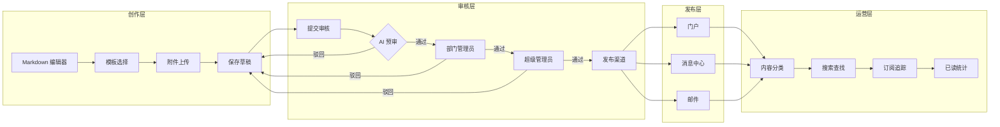

# EPIC-COM_CONTENT_MANAGE - 内容管理

> Epic 级别需求文档 | 产品域：PD-COM（数字社区）
> 
> 维护者：Tony Stark | 创建时间：2026-04-13 | 版本：v2.0（修订版）

---

## 1. 产品总览

### 1.1 一句话定位
**数据中台内容发布与通知平台，支持数据变更通知、治理公告、案例分享、文档发布等企业内部信息的高效流转。**

### 1.2 产品定位 & 核心价值

| 维度 | 描述 |
|:---|:---|
| **目标用户** | 数据管理员（发布方）、业务人员（消费方） |
| **核心痛点** | 数据中台信息分散、通知触达率低、内容查找困难 |
| **解决方案** | 统一内容平台 + Markdown 格式 + 多渠道分发 |
| **核心价值** | 信息触达率提升 60%，内容查找效率提升 50% |

### 1.3 与内容平台（ToC/ToB）的本质区别

| 维度 | ToC/ToB 内容平台（如飞书文档） | **数据中台内容管理（我们）** |
|:---|:---|:---|
| **内容性质** | 版权内容、原创文章、UGC | **数据变更通知、治理公告、案例说明、操作文档** |
| **审核重点** | 版权合规、原创保护 | **审批流（数据变更审批、公告发布审批）** |
| **生命周期** | 长期沉淀、版本迭代 | **时效性信息（过期自动归档）** |
| **安全特性** | 阅后即焚、权限控制 | **企业内部分发、无泄密风险需求** |
| **内容格式** | 富媒体、复杂排版 | **Markdown 为主、结构化文档** |

### 1.4 核心业务流程



### 1.5 核心角色 & 使用人群

| 角色 | 核心职责 | 使用场景 | 高频功能 |
|:---|:---|:---|:---|
| **超级管理员** | 全局内容管理和配置 | 内容策略制定 | 内容管理、分类配置 |
| **部门管理员** | 部门内容审核 | 数据变更审核、公告审批 | 审核管理 |
| **内容编辑** | 内容创作和发布 | 撰写通知、编辑公告 | Markdown 编辑、附件上传 |
| **普通员工** | 内容消费 | 查看通知、阅读案例 | 内容搜索、订阅追踪 |

---

## 2. 功能结构（按模块归档）

### 2.1 FEATURE-COM_CONTENT_CREATE（内容创作）

#### 功能入口 & 作用

**入口位置**：数据中台 → 内容中心 → 新建内容

#### 核心作用

- Markdown 编辑器（支持 GFM 语法）
- 预设内容模板
- 附件上传和管理
- 自动保存草稿

#### 支持的内容类型

| 内容类型 | 用途 | 示例 |
|:---|:---|:---|
| **数据变更通知** | 数据表/指标变更通知 | "交易表结构变更通知" |
| **治理公告** | 数据治理要求、政策发布 | "数据质量规范 V2.0 发布" |
| **案例说明** | 最佳实践、案例分享 | "如何用数据资产提升业务效率" |
| **操作文档** | 使用指南、操作手册 | "数据导出操作指南" |

#### Markdown 支持的扩展能力

```
支持的 Markdown 语法：
- 标题、列表、引用
- 代码块（支持语法高亮）
- 表格（GFM 表格）
- 图片（支持粘贴上传）
- 链接（支持内部跳转）
- 任务列表（- [ ]）
- 流程图（使用 Mermaid 语法）

不支持的功能：
- 版权保护
- 原创声明
- 阅后即焚
```

#### 开源组件推荐

| 组件 | 用途 | 仓库 |
|:---|:---|:---|
| **Marked** | Markdown 解析 | https://github.com/markedjs/marked |
| **highlight.js** | 代码高亮 | https://github.com/highlightjs/highlight.js |
| **Editormd** | Markdown 编辑器 | https://github.com/pandao/editor.md |
| **Mermaid** | 流程图/时序图 | https://github.com/mermaid-js/mermaid |
| **Turndown** | HTML 转 Markdown | https://github.com/mixmark-io/turndown |

---

### 2.2 FEATURE-COM_CONTENT_AUDIT（内容审核）

#### 功能入口 & 作用

**入口位置**：内容中心 → 审核管理

#### 核心作用

- 多级审批流程
- 审批意见记录
- 驳回修改重提
- 紧急发布绿色通道

#### 审核流程

```
普通内容审核：
内容编辑 → 部门管理员审核 → 超级管理员审核 → 发布

紧急内容审核（绿色通道）：
内容编辑 → 超级管理员直接审核 → 发布
```

---

### 2.3 FEATURE-COM_CONTENT_PUBLISH（内容发布）

#### 功能入口 & 作用

**入口位置**：内容中心 → 发布管理

#### 核心作用

- 多渠道分发（门户、消息、邮件）
- 定时发布
- 目标受众定向
- 内容关联（关联资产/标准）

---

### 2.4 FEATURE-COM_CONTENT_CONSUME（内容消费）

#### 功能入口 & 作用

**入口位置**：数据中台首页 → 内容中心

#### 核心作用

- 内容分类浏览
- 全文搜索
- 内容订阅
- 已读未读追踪

---

## 3. 内容分类规范（MECE 原则）

### 3.1 一级分类

| 分类 | 说明 | 内容范围 |
|:---|:---|:---|
| **通知公告** | 面向全员的重要信息发布 | 政策通知、系统公告、变更通知 |
| **数据变更** | 数据资产的变更记录 | 表结构变更、指标变更、数据源变更 |
| **案例分享** | 业务应用案例和最佳实践 | 成功案例、使用场景、数据应用故事 |
| **治理文档** | 数据治理相关的规范文档 | 质量规范、标准文档、管理办法 |
| **操作指南** | 产品操作说明文档 | 使用手册、FAQ、教程视频 |

### 3.2 二级分类示例

```
通知公告
├── 政策通知（企业数据政策）
├── 系统公告（平台功能发布/下线）
└── 变更通知（重要信息变更）

数据变更
├── 表结构变更（字段增删改）
├── 指标口径变更（计算逻辑调整）
└── 数据源变更（接入/下线）

案例分享
├── 业务应用案例（各业务域）
├── 最佳实践（数据使用技巧）
└── 团队风采（数据团队介绍）

治理文档
├── 数据质量规范
├── 数据安全规范
└── 数据标准文档

操作指南
├── 产品手册
├── 常见问题（FAQ）
└── 视频教程
```

---

## 4. 与 EPIC-COM_CONTENT_MANAGE-V1 的区别

| 功能 | V1 版本（内容平台）| V2 版本（数据中台）|
|:---|:---|:---|
| **版权保护** | ✅ 有 | ❌ 无 |
| **原创声明** | ✅ 有 | ❌ 无 |
| **阅后即焚** | ✅ 有 | ❌ 无 |
| **Markdown 支持** | ❌ 无 | ✅ 有 |
| **数据变更通知** | ❌ 无 | ✅ 有 |
| **审批流** | 简单审核 | 多级审批 + 绿色通道 |
| **内容关联** | 无 | ✅ 可关联数据资产/标准 |
| **过期自动归档** | ❌ 无 | ✅ 有 |

---

🦾 *"数据中台内容管理，轻量化、 Markdown 优先、审批流驱动。" — Tony Stark*
