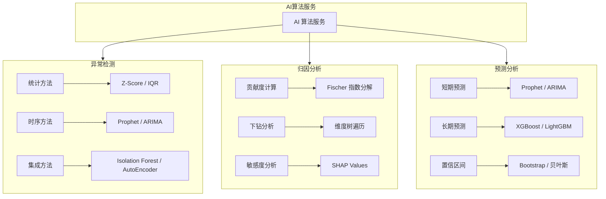

# EPIC-DEX_INTELLIGENT_INSIGHT - 智能洞察

> Epic 级别需求文档 | 产品域：PD-DEX（数据探索）
> 
> 维护者：Tony Stark | 创建时间：2026-04-13 | 版本：v2.0（修订版）

---

## 1. 产品总览

### 1.1 一句话定位
**基于 AI 能力自动分析数据规律和异常，智能生成业务洞察，让数据自己说出问题。与传统 BI 的本质区别：BI 展示数据，智能洞察理解数据。**

### 1.2 与传统 BI 的核心区别

| 维度 | 传统 BI | **智能洞察（我们）** |
|:---|:---|:---|
| **核心能力** | 数据可视化（What）| 原因分析 + 预测（What + Why + What-if）|
| **交互方式** | 人工选择维度和指标 | AI 自动发现 + 自然语言交互 |
| **分析深度** | 描述性分析（发生了什么）| **诊断性分析（为什么）+ 预测性分析（将要发生）** |
| **异常发现** | 人工设置阈值 | AI 自动识别异常，无需预设 |
| **归因能力** | 无 | 多因子拆解，自动识别主因 |
| **预测能力** | 无 | 时序预测，提前预判趋势 |
| **用户门槛** | 需要了解数据模型 | 自然语言提问，门槛极低 |

---

## 2. 核心分析场景详解

### 2.1 经营分析场景

#### 场景一：GMV 下降归因

**问题**：本周 GMV 环比下降 20%，什么原因？

**AI 洞察分析过程**：

```
Step 1: 指标拆解
GMV = 订单数 × 客单价

Step 2: 维度下钻
- 渠道拆解：APP / 小程序 / PC / H5
- 地区拆解：一线城市 / 二线城市 / 三线城市
- 时间拆解：工作日 / 周末 / 节假日
- 品类拆解：服装 / 数码 / 食品

Step 3: 贡献度计算
| 因子 | 变化量 | 贡献度 | 判定 |
|:---|---:|:---:|:---:|
| 渠道-小程序 | -15% | 60% | **主因** |
| 品类-服装 | -8% | 25% | 次因 |
| 地区-三线 | -3% | 10% | 正常波动 |
| 其他 | -2% | 5% | 可忽略 |

Step 4: 根因定位
→ 小程序渠道 GMV 下降是主因
→ 进一步分析：可能是某运营活动结束导致
```

**四则运算指标拆解规则**：

| 运算类型 | 示例 | 拆解方式 |
|:---|:---|:---|
| **乘法** | GMV = 订单数 × 客单价 | 分别分析因子变化 |
| **除法** | 转化率 = 订单数 / UV | 分析分子分母变化 |
| **加法** | 总销售额 = A品类 + B品类 | 分析各品类贡献 |
| **减法** | 流失 = 昨日UV - 今日UV | 分析流失来源 |

#### 场景二：DAU 异常预警

**问题**：APP 今日 DAU 突然下降 30%，什么原因？

**AI 自动分析**：

```
Step 1: 异常确认
- 基线：过去 30 天 DAU 均值 = 100万
- 今日 DAU = 70万
- 偏离度 = -30%（超过 3σ 阈值）
- 置信度：95%

Step 2: 多维度排查
| 维度 | 变化 | 与 DAU 下降相关性 |
|:---|:---:|:---:|
| 推送通道 | 昨日推送未发送 | **0.85** |
| 新增用户 | 无明显变化 | 0.1 |
| 活跃用户 | 下降 28% | **0.93** |
| 推送打开率 | 下降 90% | **0.88** |

Step 3: 结论
→ 原因：昨日推送通道故障导致用户未收到通知
→ 建议：检查推送通道，增加离线推送补偿
→ 预测：如果推送恢复，预计明日 DAU 恢复至 95万
```

---

### 2.2 预测分析场景

#### 常见预测算法对比

| 算法 | 适用场景 | 优点 | 缺点 | 业界使用 |
|:---|:---|:---|:---|:---|
| **Prophet** | 业务指标预测 | 对节假日敏感，易解释 | 慢，不适合高并发 | 抖音核心指标预测 |
| **ARIMA** | 稳定时序数据 | 理论基础扎实 | 需要平稳序列 | 财务预测 |
| **LSTM** | 复杂非线性序列 | 预测精度高 | 黑盒，难解释 | 股票价格 |
| **XGBoost** | 多因子预测 | 可解释特征重要性 | 需要特征工程 | 销售预测 |
| **LightGBM** | 超大规模预测 | 快，高并发 | 略低于 XGBoost | 点击率预估 |

#### AI 时代的预测能力增强

| 传统预测 | AI 增强预测 |
|:---|:---|
| 基于历史数据趋势外推 | **引入外部信号**（搜索指数、社交热度、宏观经济）|
| 单一模型 | **多模型融合**（集成学习）|
| 固定阈值告警 | **动态基线**（自适应季节性、节假日）|
| 周期性复盘 | **实时预测 + 预警触发** |
| 人工调参 | **AutoML 自动优化参数** |

#### 预测能力在数据中台的应用

```
应用场景：

1. 指标预测
   - 预测下周 GMV = 8000万 ± 5%
   - 预测下月数据资产增长量
   - 预测存储成本趋势

2. 异常预测
   - 预测某指标明日将异常
   - 提前触发预防性告警

3. 容量预测
   - 预测数据仓库存储需求
   - 预测计算资源使用趋势
```

---

### 2.3 归因分析详解

#### 归因分析方法论

| 方法 | 适用场景 | 说明 |
|:---|:---|:---|
| **贡献度分析** | 多因子叠加影响 | 计算各因子对总体变化的贡献比例 |
| **对比分析** | 同期/环比变化 | 时间维度对比、分类维度对比 |
| **下钻分析** | 定位异常层级 | 从汇总到明细逐层下钻 |
| **敏感度分析** | 因子重要性排序 | 分析各因子对结果的敏感程度 |

#### 归因分析案例

**案例：营销活动效果归因**

```
问题：本周营销活动投入增加 50%，但 GMV 只增长 10%，为什么？

分析过程：

1. 拆解 GMV 公式
   GMV = 曝光 × 点击率 × 转化率 × 客单价

2. 分析各因子变化
   | 因子 | 活动前 | 活动中 | 变化 |
   |:---|:---:|:---:|:---:|
   | 曝光（万）| 1000 | 1500 | +50% |
   | 点击率 | 5% | 4% | -20% |
   | 转化率 | 3% | 2.5% | -17% |
   | 客单价（元）| 200 | 190 | -5% |

3. 计算实际贡献
   期望 GMV 增长 = 50% × 5% × 3% × 200 = 1500万
   实际 GMV = 1500 × 4% × 2.5% × 190 = 1425万
   
4. 根因定位
   → 点击率和转化率下降是主因
   → 可能是素材疲劳或人群定向问题
   → 建议：更换素材、优化人群定向
```

---

## 3. 功能结构

### 3.1 FEATURE-DEX_INSIGHT_AUTO_ANALYSIS（自动洞察分析）

| 功能 | 说明 | 优先级 |
|:---|:---|:---:|
| 趋势检测 | 自动识别上升/下降/平稳趋势 | P0 |
| 异常检测 | 基于统计+时序的异常识别 | P0 |
| 维度下钻 | 多维度自动下钻分析 | P0 |
| 归因分析 | 多因子拆解 + 贡献度计算 | P0 |
| 预测分析 | 时序预测 + 置信区间 | P1 |

### 3.2 FEATURE-DEX_INSIGHT_ALERT（智能预警）

| 功能 | 说明 | 优先级 |
|:---|:---|:---:|
| 动态基线 | 自适应节假日/周期 | P0 |
| 多级预警 | P0/P1/P2/P3 分级 | P0 |
| 智能聚合 | 同类预警合并，减少噪音 | P1 |
| 升级机制 | 无人处理时自动升级 | P1 |

### 3.3 FEATURE-DEX_INSIGHT_NLQUERY（自然语言分析）

| 功能 | 说明 | 优先级 |
|:---|:---|:---:|
| 问事实 | "昨天的 DAU 是多少？" | P0 |
| 问原因 | "GMV 下降的原因是什么？" | P0 |
| 问预测 | "下周 GMV 预计是多少？" | P1 |
| 问建议 | "我应该怎么优化？" | P1 |

---

## 4. 与竞品对比

| 能力 | FineBI 智能分析 | QuickBI 智能小Q | **我们（智能洞察）** |
|:---|:---|:---|:---|
| 自动异常检测 | 基础 | 基础 | **强（多算法融合）** |
| 归因分析 | 无 | 无 | **强（多因子拆解）** |
| 预测分析 | 基础 | 基础 | **强（多模型集成）** |
| 自然语言查询 | 无 | 支持 | **支持（计划中）** |
| 动态基线 | 无 | 无 | **支持** |

---

## 5. 技术架构

### 5.1 AI 算法层



### 5.2 开源组件推荐

| 组件 | 用途 | 仓库 |
|:---|:---|:---|
| **Prophet** | 时序预测 | facebook/prophet |
| **PyOD** | 异常检测 | yzhao062/pyod |
| **SHAP** | 归因解释 | slundberg/shap |
| **statsmodels** | 统计检验 | statsmodels/statsmodels |
| **PMPy** | 指标拆解 | 自研 |

---

🦾 *"智能洞察，让 AI 理解数据，洞察本质。传统 BI 告诉你发生了什么，智能洞察告诉你为什么、将要发生什么、你应该怎么做。" — Tony Stark*
