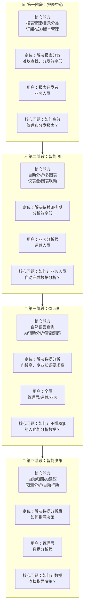

# EPIC-DEX_REPORT_CENTER - 报表中心

> Epic 级别需求文档 | 产品域：PD-DEX（数据探索）
> 
> 维护者：Tony Stark | 创建时间：2026-04-13 | 版本：v2.0（修订版）

---

## 1. 产品总览

### 1.1 一句话定位
**企业级报表的统一管理平台，支持报表的创建、分享、订阅和权限管理。核心定位：从报表管理出发，逐步演进到智能 BI，最终走向 ChatBI 时代。**

### 1.2 产品演进路线图



---

## 2. 各阶段核心问题与解决方案

### 2.1 第一阶段：报表中心（现状）

#### 核心问题

| 问题 | 描述 |
|:---|:---|
| **分散管理** | 报表分布在各个系统，难以统一查找 |
| **传递低效** | 报告通过邮件/微信传递，版本混乱 |
| **权限混乱** | 谁能看到什么报表不清楚 |
| **版本混乱** | 报表变更后旧版本无法追溯 |

#### 解决方案

| 能力 | 说明 |
|:---|:---|
| **统一目录** | 分类组织所有报表，支持多级目录 |
| **订阅推送** | 配置订阅规则，定期自动推送 |
| **权限管理** | 完善的权限体系（查看/导出/编辑/管理）|
| **版本管理** | 版本历史记录，支持回滚 |

### 2.2 第二阶段：智能 BI

#### 核心问题

| 问题 | 描述 |
|:---|:---|
| **开发瓶颈** | 业务需求依赖 BI 开发排期，等待时间长 |
| **效率低下** | 每次分析都需要重新配置图表 |
| **门槛较高** | 需要了解数据模型和图表制作 |

#### 解决方案

| 能力 | 说明 |
|:---|:---|
| **自助分析** | 拖拽式配置，快速生成图表 |
| **丰富图表** | 折线、柱状、饼图、地图、漏斗等 |
| **仪表盘** | 多图表组合，支持联动和筛选 |
| **数据集管理** | 预定义数据集，复用分析思路 |

### 2.3 第三阶段：ChatBI

#### 核心问题

| 问题 | 描述 |
|:---|:---|
| **门槛高** | 仍需要拖拽配置，不够直观 |
| **效率低** | 想看一个指标需要多步操作 |
| **理解难** | 自然语言和数据模型之间有鸿沟 |

#### 解决方案

| 能力 | 说明 |
|:---|:---|
| **自然语言查询** | "显示本月销售额" → 自动生成图表 |
| **智能推荐** | 根据使用习惯推荐相关报表 |
| **追问交互** | 支持多轮对话，深入分析 |
| **数据解释** | AI 自动解读图表关键发现 |

### 2.4 第四阶段：智能决策

#### 核心问题

| 问题 | 描述 |
|:---|:---|
| **分析后迷茫** | 知道数据变化，但不知道该怎么做 |
| **被动响应** | 需要人工巡检发现异常 |
| **预测盲区** | 只能看历史，无法预判未来 |

#### 解决方案

| 能力 | 说明 |
|:---|:---|
| **自动归因** | 数据变化时自动分析原因 |
| **AI 建议** | 基于数据给出优化建议 |
| **预测分析** | 预测未来趋势，提前预警 |
| **自动行动** | 触发业务流程（如自动调整预算）|

---

## 3. 功能范围定义（MECE 原则）

### 3.1 报表中心（第一阶段）功能范围

| 模块 | 功能 | 说明 |
|:---|:---|:---|
| **FEATURE-REPORT_CATALOG** | 报表目录管理 | 多级目录、分类组织 |
| | 报表搜索 | 关键字搜索、元信息搜索 |
| | 报表收藏 | 个人收藏夹 |
| **FEATURE-REPORT_SUBSCRIPTION** | 订阅配置 | 周期、接收人、格式 |
| | 订阅管理 | 订阅列表、退订 |
| **FEATURE-REPORT_VERSION** | 版本历史 | 变更记录、回滚 |
| **FEATURE-REPORT_PERMISSION** | 权限管理 | 查看/导出/编辑/管理 |

### 3.2 与自助分析（第二阶段）的边界

| 能力 | 报表中心 | 自助分析 |
|:---|:---|:---|
| **报表创建** | ❌ 导入已有报表 | ✅ 拖拽创建 |
| **图表配置** | ❌ 预设图表 | ✅ 自由配置 |
| **仪表盘** | ❌ 不涉及 | ✅ 多图表组合 |
| **数据查询** | ❌ 依赖外部 | ✅ 内置查询 |
| **核心定位** | 管理已有报表 | 创建新分析 |

### 3.3 与智能洞察（第三/四阶段）的边界

| 能力 | 报表中心 | 智能洞察/ChatBI |
|:---|:---|:---|
| **分析方式** | 预设报表查看 | AI 自动发现 + 自然语言 |
| **数据发现** | 人工巡检 | AI 自动异常检测 |
| **归因分析** | 无 | AI 自动归因 |
| **预测能力** | 无 | 时序预测 |
| **核心定位** | 报表管理 | 智能分析 |

---

## 4. 核心角色演进

```
第一阶段（报表中心）：
 报表开发者 → 制作报表 → 发布到目录 → 配置订阅
 业务人员 → 浏览目录 → 订阅报表

第二阶段（智能 BI）：
 业务分析师 → 自助创建图表 → 制作仪表盘 → 发布分享
 运营人员 → 拖拽分析 → 查看仪表盘

第三阶段（ChatBI）：
 任何人 → 自然语言提问 → AI 生成答案 → 追问深入
 管理层 → 问经营情况 → AI 自动解读

第四阶段（智能决策）：
 数据分析师 → AI 辅助分析 → 自动归因 → AI 建议
 管理层 → AI 预警 + 建议 → 决策支持
```

---

## 5. 技术演进规划

### 5.1 第一阶段技术栈

| 组件 | 技术 | 说明 |
|:---|:---|:---|
| 后端 | Java + Spring Boot | 报表管理服务 |
| 存储 | MySQL + OSS | 报表元数据 + 文件存储 |
| 前端 | Vue 3 + Element Plus | 管理后台 |
| 调度 | XXL-Job | 订阅任务调度 |

### 5.2 第二阶段技术栈

| 组件 | 技术 | 说明 |
|:---|:---|:---|
| 图表引擎 | ECharts / AntV | 可视化渲染 |
| OLAP | ClickHouse | 高性能分析查询 |
| 缓存 | Redis | 查询结果缓存 |

### 5.3 第三阶段技术栈

| 组件 | 技术 | 说明 |
|:---|:---|:---|
| NL2SQL | SQL生成模型 | 自然语言转 SQL |
| 向量数据库 | ChromaDB | 语义搜索 |
| LLM | GPT-4 / 通义千问 | 对话交互 |

### 5.4 第四阶段技术栈

| 组件 | 技术 | 说明 |
|:---|:---|:---|
| 异常检测 | PyOD + Prophet | 智能异常发现 |
| 归因分析 | SHAP + 自研 | 因子贡献计算 |
| 预测模型 | XGBoost + LSTM | 时序预测 |

---

## 6. 里程碑规划

| 阶段 | 时间 | 交付内容 | 核心指标 |
|:---|:---|:---|:---|
| **第一阶段** | 2026-Q2 | 报表目录 + 订阅 + 版本 + 权限 | 报表复用率提升 60% |
| **第二阶段** | 2026-Q3 | 自助分析 + 仪表盘 + 图表联动 | 分析报告产出效率提升 80% |
| **第三阶段** | 2026-Q4 | ChatBI + 自然语言查询 | 数据分析民主化，用户覆盖 +100% |
| **第四阶段** | 2027-Q1 | 智能归因 + 预测 + AI 建议 | 决策效率提升 50% |

---

🦾 *"报表中心不是终点，而是数据民主化的起点。从管理报表，到人人能分析，再到 AI 辅助决策。" — Tony Stark*
