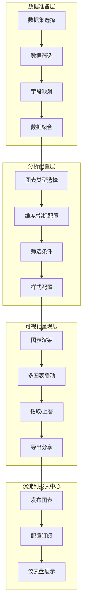
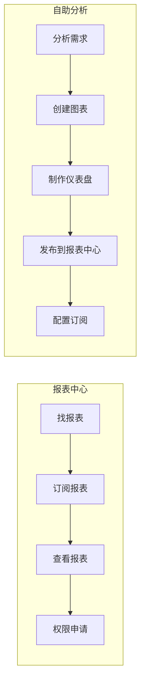
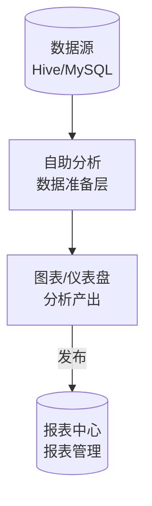
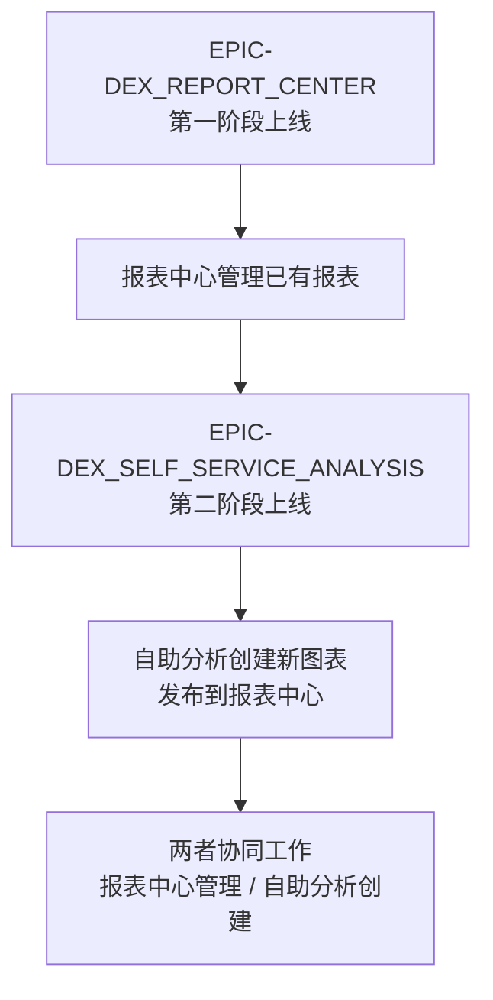

# EPIC-DEX_SELF_SERVICE_ANALYSIS - 自助分析

> Epic 级别需求文档 | 产品域：PD-DEX（数据探索）
> 
> 维护者：Tony Stark | 创建时间：2026-04-13 | 版本：v2.0（修订版）

---

## 1. 产品总览

### 1.1 一句话定位
**提供丰富的可视化图表和自助分析模板，让用户通过拖拽配置即可完成数据分析，无需专业技能。是 EPIC-DEX_REPORT_CENTER 的下游能力延伸，解决「如何创建分析」的问题。**

### 1.2 与报表中心的本质区别

| 维度 | 报表中心 | **自助分析（我们）** |
|:---|:---|:---|
| **核心问题** | 报表分散如何管理？ | **分析需求如何快速满足？** |
| **入口** | 已有报表如何分发？ | **没有报表如何创建？** |
| **用户角色** | 报表开发者（生产者视角）| 业务分析师（创作者视角）|
| **核心操作** | 浏览、订阅、权限 | **拖拽、配置、创建** |
| **输出物** | 报表的集合管理 | **图表、仪表盘、分析报告** |
| **关系** | 上游（管理已有）| **下游（创建新的）** |

### 1.3 核心业务流程

### 1.4 核心角色 & 使用人群

| 角色 | 核心职责 | 使用场景 | 高频功能 |
|:---|:---|:---|:---|
| **业务分析师** | 制作日常分析报表 | 数据监控、效果分析 | 拖拽图表、筛选过滤 |
| **运营人员** | 活动效果分析 | 活动复盘、用户分析 | 多图表对比、趋势分析 |
| **产品经理** | 产品数据分析 | 漏斗分析、留存分析 | 下钻分析、指标计算 |
| **管理层** | 业务数据概览 | 经营看板、决策支持 | 核心指标仪表盘 |

---

## 2. 与 EPIC-DEX_REPORT_CENTER 的边界对比

### 2.1 MECE 原则下的能力划分

| 能力域 | 报表中心 | 自助分析 |
|:---|:---|:---|
| **报表管理** | ✅ 目录、分类、搜索、元信息 | ❌ 不涉及 |
| **订阅推送** | ✅ 订阅配置、发送历史 | ❌ 不涉及 |
| **版本控制** | ✅ 版本历史、回滚 | ❌ 不涉及 |
| **权限管理** | ✅ 查看/导出/编辑权限 | ❌ 不涉及 |
| **数据接入** | ❌ 不涉及 | ✅ 数据集配置、SQL 查询 |
| **图表创建** | ❌ 不涉及 | ✅ 拖拽图表、样式配置 |
| **仪表盘** | ❌ 不涉及 | ✅ 仪表盘创建、布局、联动 |
| **导出分享** | ✅ 报表导出 | ✅ 图表/仪表盘导出 |

### 2.2 用户旅程中的位置

### 2.3 数据流向

---

## 3. 功能结构

### 3.1 FEATURE-DEX_DATASET_MANAGE（数据集管理）

| 功能 | 说明 | 优先级 |
|:---|:---|:---:|
| 数据源连接 | 支持 Hive/MySQL/ClickHouse | P0 |
| SQL 查询 | 可视化 SQL 编辑器 | P0 |
| 字段映射 | 维度/指标类型识别 | P0 |
| 数据预览 | 采样数据预览 | P0 |
| 计算字段 | 基于现有字段的衍生计算 | P1 |
| 数据刷新 | 定时刷新配置 | P1 |

### 3.2 FEATURE-DEX_CHART_STUDIO（图表工作室）

| 功能 | 说明 | 优先级 |
|:---|:---|:---:|
| 图表类型 | 折线/柱状/饼图/散点/地图 | P0 |
| 拖拽配置 | 拖拽绑定维度/指标 | P0 |
| 样式配置 | 颜色/标题/图例/标签 | P0 |
| 交互配置 | 悬停/点击/缩放 | P1 |
| 图表推荐 | 基于数据特征推荐图表 | P2 |
| 参考线 | 平均值/目标线/预警线 | P1 |

### 3.3 FEATURE-DEX_DASHBOARD（仪表盘）

| 功能 | 说明 | 优先级 |
|:---|:---|:---:|
| 布局设计 | 拖拽式布局调整 | P0 |
| 图表添加 | 添加已有图表/新建图表 | P0 |
| 筛选器 | 日期/下拉/多选筛选器 | P0 |
| 图表联动 | 点击联动/参数传递 | P1 |
| 订阅刷新 | 自动刷新配置 | P1 |
| 发布分享 | 发布到报表中心 | P0 |

### 3.4 FEATURE-DEX_EXPORT_SHARE（导出分享）

| 功能 | 说明 | 优先级 |
|:---|:---|:---:|
| 图表导出 | PNG/CSV/Excel | P0 |
| 仪表盘导出 | PDF/PPT | P1 |
| 嵌入分享 | 链接嵌入/iframe | P1 |
| 分享权限 | 设置分享范围 | P0 |

---

## 4. 术语词典（本体论级别）

| 术语 | 英文 | 定义 | 示例 |
|:---|:---|:---|:---|
| **数据集** | Dataset | 经过配置的数据查询结果，可被图表复用 | "销售数据集"包含订单、销售额等字段 |
| **维度** | Dimension | 分类/描述性字段，用于分组 | 地区、时间、产品类别 |
| **指标** | Measure | 可计算的数值字段，用于聚合 | 销售额、订单数、UV |
| **图表联动** | Chart Linkage | 多图表之间联动交互 | 点击地图省份，表格筛选该省数据 |
| **钻取** | Drill-down | 从汇总数据深入到细分维度 | 从年度数据钻取到月度数据 |
| **上卷** | Roll-up | 从明细数据汇总到更高层级 | 从日数据上卷到月数据 |
| **计算字段** | Calculated Field | 基于现有字段计算的衍生字段 | 客单价 = 销售额 / 订单数 |
| **仪表盘** | Dashboard | 多个图表的组合展示页面 | "经营驾驶舱"仪表盘 |

---

## 5. 与竞品对比

| 能力 | Tableau | Power BI | **自助分析（我们）** |
|:---|:---|:---|:---|
| 拖拽分析 | ✅ 强 | ✅ 强 | ✅ 强 |
| 图表丰富度 | 丰富 | 丰富 | 丰富（ECharts）|
| 数据源连接 | 多 | 多 | 中等（聚焦数仓）|
| 与报表中心整合 | ❌ 无 | ❌ 无 | ✅ **深度整合** |
| 学习成本 | 高 | 中 | 低 |
| 定位 | 独立 BI | 独立 BI | **企业内部分析 + 报表管理** |

---

## 6. 结论：两个 Epic 是否应该合并？

### 6.1 结论：**不应合并**

| 原因 | 说明 |
|:---|:---|
| **职责不同** | 报表中心管「已有报表」，自助分析管「创建新分析」 |
| **用户不同** | 报表中心面向报表开发者，自助分析面向业务分析师 |
| **演进节奏** | 报表中心先建设，自助分析后建设，独立迭代 |
| **MECE 原则** | 两者覆盖不同能力域，无重叠 |

### 6.2 建议的演进关系

---

🦾 *"报表中心管『已有的』，自助分析创『新的』。两者分工明确，协同工作。" — Tony Stark*
