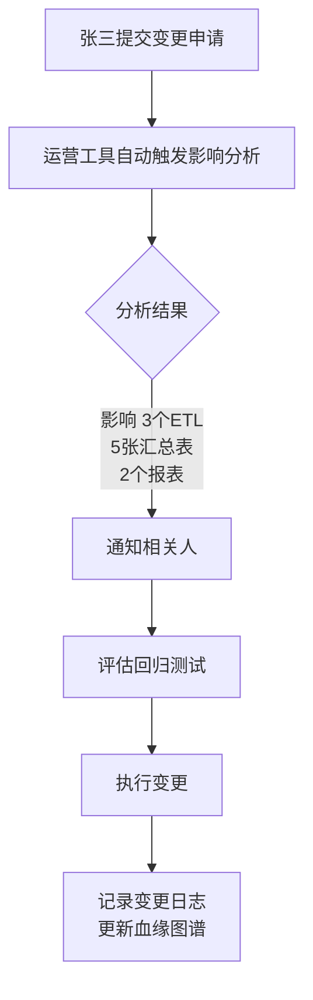
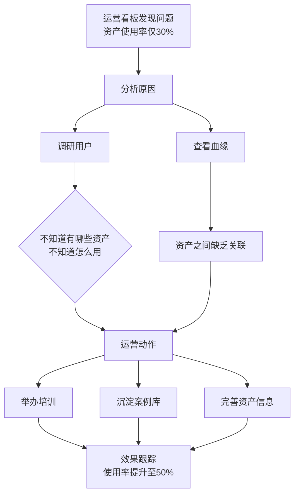
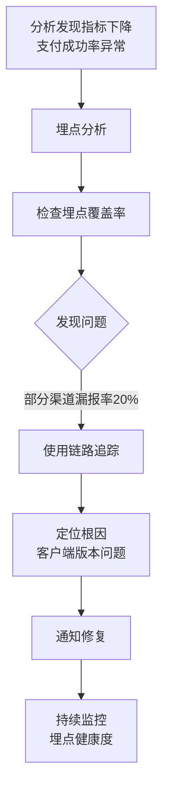

# EPIC-DFD_ASSET_OPERATE_TOOL - 数据资产运营工具

> Epic 级别需求文档 | 产品域：PD-DFD（数据发现）
>
> 维护者：Tony Stark | 创建时间：2026-04-13 | 版本：v2.0（修订版）

---

## 1. 产品总览

### 1.1 一句话定位
**数据资产的运营分析平台，提供血缘分析、影响分析、埋点分析等能力，支撑数据团队的运营工作（培训、案例、数据维护、用户运营），让数据资产真正被用起来。**

### 1.2 与「管理」的本质区别

| 维度 | 管理工具（如数据资产字典）| **运营工具（我们）** |
|:---|:---|:---|
| **核心问题** | 数据资产是什么？ | **数据资产用得怎么样？** |
| **关注点** | 资产信息记录 | **资产运营效果分析** |
| **核心能力** | CRUD（增删改查）| **分析洞察 + 运营动作** |
| **用户** | 数据管理员（维护资产）| **运营人员（推动资产使用）** |
| **产出** | 资产清单 | **运营策略、改进建议** |

### 1.3 不包含的能力

以下能力在**数据资产字典（EPIC-DFD_DATA_ASSET）**中管理，不在本 Epic 范围内：

| 能力 | 说明 | 归属 |
|:---|:---|:---|
| **资产目录** | 资产的分类目录管理 | EPIC-DFD_DATA_ASSET |
| **资产信息管理** | 资产的增删改查 | EPIC-DFD_DATA_ASSET |
| **资产权限管理** | 权限的申请/审批/授予 | EPIC-COM_PERM_MANAGE |
| **资产搜索发现** | 资产的搜索和浏览 | EPIC-DFD_UNIFIED_SEARCH |

---

## 2. 核心功能模块

### 2.1 FEATURE-DFD_LINEAGE_ANALYSIS（血缘分析）

**问题**：这条数据的来源是什么？上游有哪些表/任务？

| 功能 | 说明 | 优先级 |
|:---|:---|:---:|
| 血缘图谱 | 展示字段级/表级血缘关系 | P0 |
| 血缘路径 | 从指定节点向上/下游追溯 | P0 |
| 血缘采集 | 从 SQL/日志自动解析血缘 | P0 |
| 血缘统计 | 血缘覆盖度、高频使用链路 | P1 |
| 血缘质量 | 血缘完整性、冲突检测 | P2 |

### 2.2 FEATURE-DFD_IMPACT_ANALYSIS（影响分析）

**问题**：如果这个表变更了，会影响哪些下游？

| 功能 | 说明 | 优先级 |
|:---|:---|:---:|
| 影响评估 | 变更前的下游影响范围评估 | P0 |
| 影响图谱 | 可视化展示影响链路 | P0 |
| 变更预警 | 下游表变更时通知相关人 | P1 |
| 影响报告 | 生成变更影响报告 | P1 |
| 回归测试建议 | 基于血缘的测试范围建议 | P2 |

### 2.3 FEATURE-DFD_TRACKING_ANALYSIS（埋点分析）

**问题**：这个功能用户用得怎么样？数据质量如何？

| 功能 | 说明 | 优先级 |
|:---|:---|:---:|
| 埋点覆盖率 | 资产埋点覆盖率统计 | P0 |
| 埋点质量 | 埋点数据完整性、准确性分析 | P0 |
| 使用链路 | 从埋点到业务的完整链路追踪 | P1 |
| 埋点健康度 | 埋点异常检测和预警 | P1 |
| 埋点优化建议 | 基于分析给出优化建议 | P2 |

### 2.4 FEATURE-DFD_ORG_OPERATION（组织运营）

**问题**：运营动作如何推动资产使用？

| 功能 | 说明 | 优先级 |
|:---|:---|:---:|
| 培训管理 | 培训计划、培训记录、培训反馈 | P0 |
| 案例库 | 优秀使用案例的沉淀和分享 | P0 |
| 数据维护 | 资产信息完善度监控、负责人管理 | P1 |
| 用户运营 | 用户活跃度分析、沉默用户激活 | P1 |
| 运营看板 | 资产使用大盘、运营指标监控 | P0 |

---

## 3. 功能结构（MECE 原则）

### 3.1 模块划分

```
EPIC-DFD_ASSET_OPERATE_TOOL（数据资产运营工具）
│
├── FEATURE-DFD_LINEAGE_ANALYSIS（血缘分析）
│   ├── 血缘图谱
│   ├── 血缘路径
│   ├── 血缘采集
│   └── 血缘统计
│
├── FEATURE-DFD_IMPACT_ANALYSIS（影响分析）
│   ├── 影响评估
│   ├── 影响图谱
│   ├── 变更预警
│   └── 影响报告
│
├── FEATURE-DFD_TRACKING_ANALYSIS（埋点分析）
│   ├── 埋点覆盖率
│   ├── 埋点质量
│   ├── 使用链路
│   └── 埋点健康度
│
└── FEATURE-DFD_ORG_OPERATION（组织运营）
    ├── 培训管理
    ├── 案例库
    ├── 数据维护
    ├── 用户运营
    └── 运营看板
```

### 3.2 与其他 Epic 的边界

| 能力 | 运营工具（我们） | 数据资产字典 | 统一搜索 |
|:---|:---|:---|:---|
| 血缘展示 | ✅ 分析用 | ❌ 信息记录 | ❌ 搜索用 |
| 资产目录 | ❌ 不涉及 | ✅ 管理目录 | ❌ 不涉及 |
| 权限管理 | ❌ 不涉及 | ❌ 权限中心 | ❌ 不涉及 |
| 资产搜索 | ❌ 不涉及 | ❌ 不涉及 | ✅ 搜索能力 |
| 埋点分析 | ✅ 运营分析 | ❌ 不涉及 | ❌ 不涉及 |

---

## 4. 核心场景

### 4.1 场景一：数据变更影响评估

> 背景：数据开发张三要修改「订单表」的结构



### 4.2 场景二：资产运营推动

> 背景：数据运营李四负责推动数据资产的使用



### 4.3 场景三：埋点质量治理

> 背景：业务分析发现数据波动异常



---

## 5. 运营指标体系

### 5.1 核心指标

| 指标 | 定义 | 计算逻辑 |
|:---|:---|:---|
| **资产使用率** | 被使用的资产/总资产 | `active_asset / total_asset` |
| **血缘覆盖率** | 有血缘的资产/总资产 | `lineage_covered / total_asset` |
| **埋点覆盖率** | 已埋点的表/需要埋点的表 | `tracked_table / need_track_table` |
| **平均使用深度** | 用户平均使用的资产数 | `avg(assets_per_user)` |
| **培训覆盖率** | 参加培训的用户/应参加用户 | `trained_user / target_user` |

### 5.2 运营健康度

```
健康度 = 血缘健康度 × 30% + 使用健康度 × 40% + 质量健康度 × 30%

血缘健康度：
- 血缘覆盖率 ≥ 80% → 100分
- 70% ≤ 覆盖率 < 80% → 80分
- 覆盖率 < 70% → 60分

使用健康度：
- 月活跃用户 ≥ 100 → 100分
- 50 ≤ 月活 < 100 → 80分
- 月活 < 50 → 60分

质量健康度：
- 埋点覆盖率 ≥ 90% → 100分
- 80% ≤ 覆盖率 < 90% → 80分
- 覆盖率 < 80% → 60分
```

---

## 6. 依赖关系

### 6.1 上游依赖

| 依赖 | 说明 | 必要性 |
|:---|:---|:---:|
| EPIC-DFD_DATA_ASSET | 获取资产基础信息 | 必须 |
| EPIC-DMT_METADATA_MANAGE | 元数据采集血缘信息 | 必须 |
| EPIC-DEX_SELF_SERVICE_ANALYSIS | 分析结果可视化 | 必须 |

### 6.2 下游使用

| 系统 | 如何使用 |
|:---|:---|
| 数据资产字典 | 提供资产信息展示入口 |
| 自助分析 | 分析结果可沉淀为仪表盘 |
| 运营看板 | 运营指标展示 |

---

## 7. 里程碑

| 里程碑 | 时间 | 交付内容 |
|:---|:---|:---|
| M1 | 2026-Q2 | 血缘图谱 + 影响分析 |
| M2 | 2026-Q3 | 埋点分析 + 运营看板 |
| M3 | 2026-Q4 | 组织运营（培训 + 案例） |

---

## 8. 术语表

| 术语 | 定义 |
|:---|:---|
| 血缘分析 | 分析数据从源头到消费的全链路关系 |
| 影响分析 | 评估数据变更对下游的影响范围 |
| 埋点分析 | 分析数据采集的覆盖度和质量 |
| 组织运营 | 通过培训、案例等手段推动资产使用 |
| 资产使用率 | 被使用的资产占总资产的比例 |

---

🦾 *"数据资产运营工具，不是管理工具，是推动数据资产被用起来的运营分析平台。血缘是基础，影响是保障，运营是关键。" — Tony Stark*
